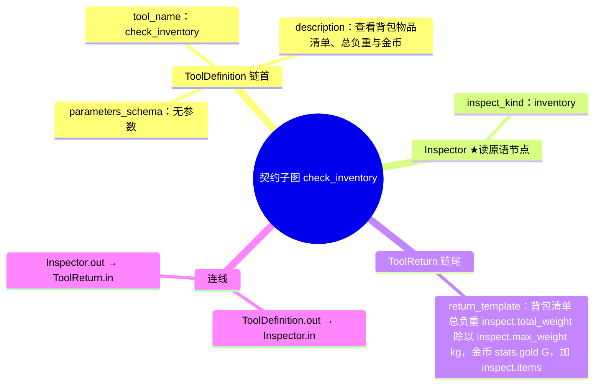
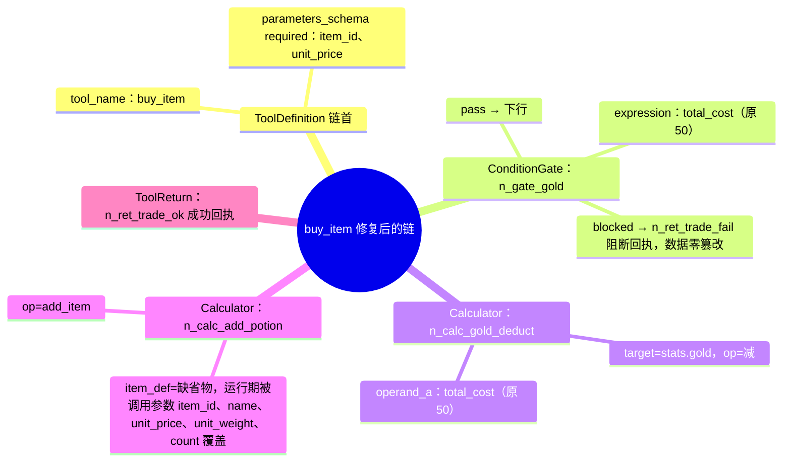
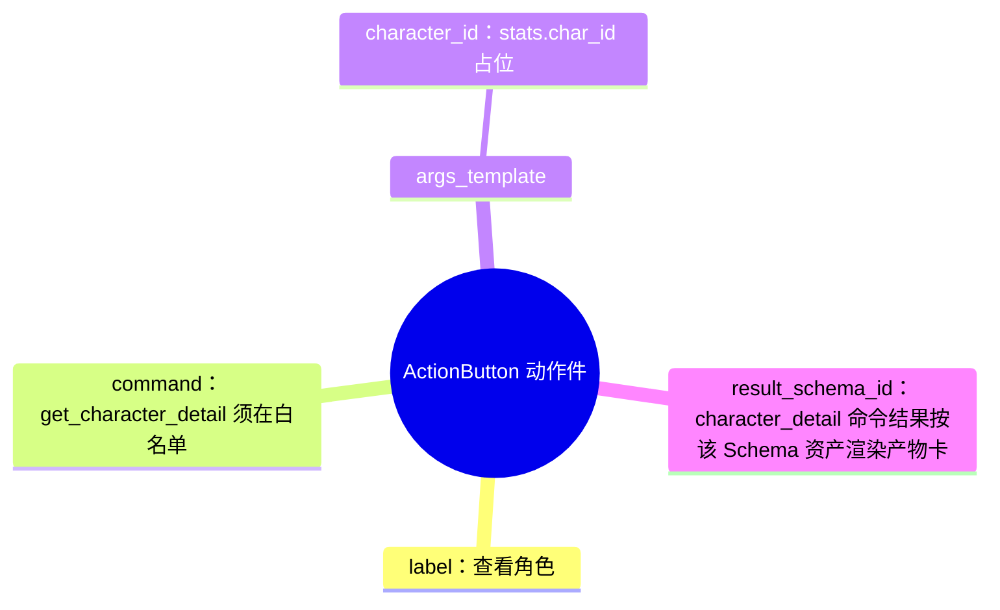
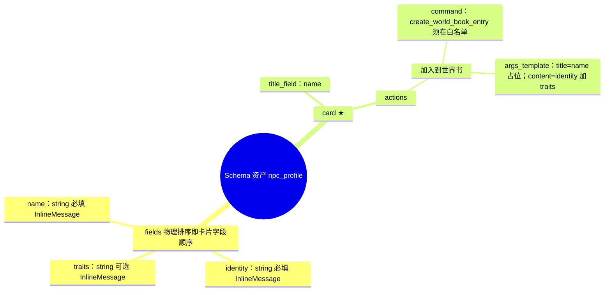
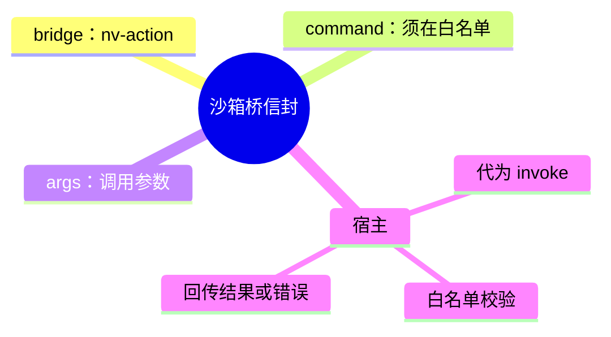
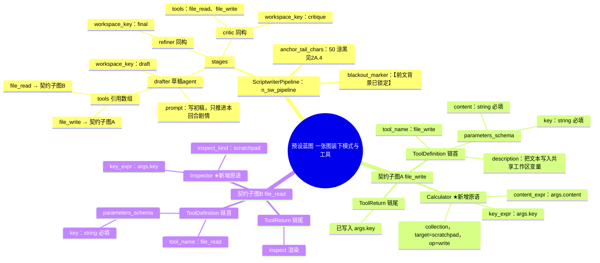
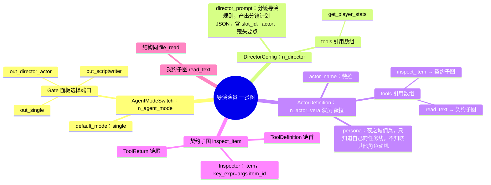
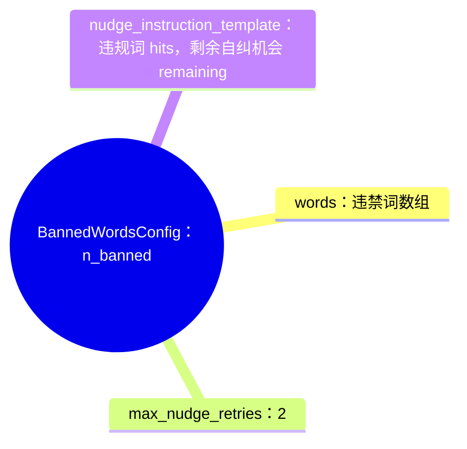
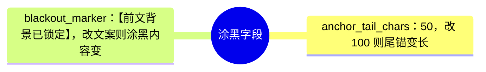
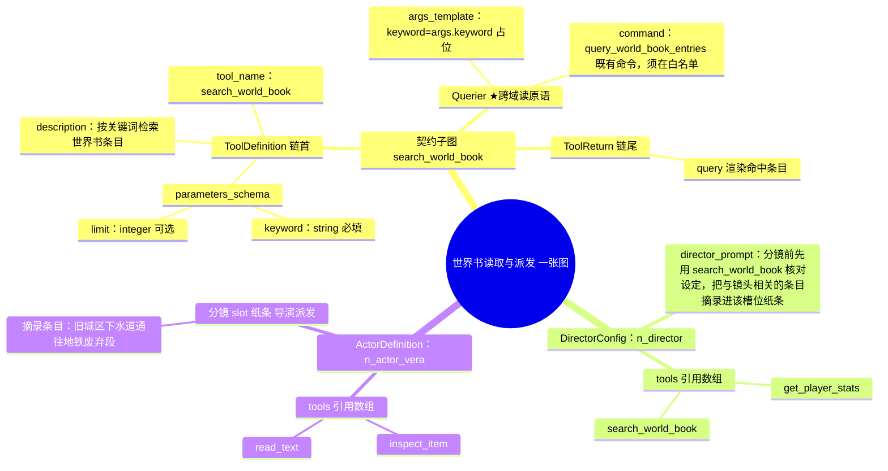

# Night Voyage 不可知化核心重构：容器与计算器即边界（全计划覆盖 v5·Mermaid 思维导图版）

> **裁定来源**：用户架构决策（2026-09-27）——"我们只提供容器与计算器，不要提供具体功能，默认为具体功能不可知化"。
> **验收补充裁定**（同日）：① 每个新增机制给出**Mermaid 思维导图**（叶节点即实现字段名）与**非硬编码判据**（改资产→行为变、零代码）；② 覆盖**计划全文**；③ 每个模式与功能必须说明"如何从蓝图定义"，定义载体缺失按硬编码论处。
> **真相源关系**：计划 §1–§10 有效；唯一冲突点：计划 §2.1 原生内置契约工具取消，改以"标准库蓝图资产"落地（§2.2）。
> **架构约束**：`AGENTS.md` C1–C11 有效。实现期 serde 字段名以各导图叶节点为准。导图为 Mermaid `mindmap`，查看器需支持 Mermaid 渲染（Typora / VSCode Mermaid 插件 / Obsidian）。

---

## 0. 三条不变量 + 零改动区

| 编号 | 不变量 | 判据 |
|---|---|---|
| I1 语义上移 | 一切业务与玩法语义只存在于资产层（蓝图图节点 config、UI 布局、Schema、白名单设置）；源码出现业务名词或玩法常量即违规 | 源码 grep 为零；§2 每机制附思维导图与"非硬编码判据" |
| I2 显式失败 | 资产未定义 = 显式报错；零兜底零降级（C2） | 未定义契约/未注册白名单/引用不存在均显式报错 |
| I3 机制正交 | 容器计算器、动作通道、产物通道、编排机制四层互不感知 | 层间无业务类型 import；新增功能域零代码改动 |

**零改动区（重构不触碰，验收不得发现差异）**：STATELESS/LEGACY 传统对话流；Schema 体系全部（编辑器、retention_depth 倒序裁剪、display_target 双通道、字段物理排序、InvokeSchema）；三态记忆调度（ModeSwitch）；确定性 D20 机制；禁词扫描流程骨架（Nudge 状态机）。

## 1. 机制分层

- **L1 容器与计算器**（保留已实现）：DataContainer；Calculator math/collection + `resolve_operand`；add_item 参数覆盖 item_def；ConditionGate gold/weight/slots。
- **L2 契约解释器**：保留 ToolPlan 编译/校验/执行；新增 `Inspector`（容器读）与 `Querier`（跨域读，经白名单命令代理）链节点；合法链类型 +inspector +querier；**废除 execute_builtin_tool 与 None 兜底臂**（显式报错）；契约注册表 = 编译产物 active_tools；MCP 描述去名词化。
- **L3 动作通道**：ActionButton + 命令白名单（settings 表数据，设置页增删，默认空）+ 结果回注 + C4 沙箱桥（postMessage 白名单信封）。
- **L4 产物通道**：产物卡 = Schema 资产 `card` 扩展；两个来源（InvokeSchema 结构化输出 / L3 命令结果）；待确认两态；无模板注册表。
- **L5 编排机制**：导演-演员、剧本流水线、Nudge 的**流程骨架是机制，可调语义是节点 config**；子代理/各阶段工具集 = 节点 config 内对图中 ToolDefinition `tool_name` 的**引用数组**（编译期校验存在，缺失硬错）；语义载体 = 计划 §7.1 五个至今未实现的节点类型（§2A 落地）。

## 2. 资产配置契约（思维导图 + 非硬编码判据）

### 2.0 求值器（共用）

- 数值表达式（Calculator/ConditionGate/数值参数位）：`resolve_operand`——`args.<k>`、`stats.<k>`、`total_cost=unit_price×count`、`added_weight`、四则、clamp。
- 字符串模板（ToolReturn/args_template 字符串位）：`{表达式}` 占位符；上下文栈 = `card.<k>`（卡内）→ `inspect`（容器读）→ `query`（跨域读）→ 调用参数 → `stats.<k>`。

### 2.1 标准库读类资产：契约子图 check_inventory（M1/M6）

同构导出：get_player_stats（inspect_kind=stats）、inspect_item（item + key_expr=args.item_id）、read_text（scratchpad + key_expr=args.key）。

**非硬编码判据**：改 return_template → 回执即变；剪断链 → 空链仅校验；内置删除后此链是 check_inventory 的唯一实现。

### 2.2 预设 27 buy_item 修复（M2 主证据）

现状病灶（实测图）：四个 ToolDefinition 串联（结构非法）；金币门禁 expression="50"、扣减 operand_a="50"、item_def 固定药剂——全部常量。

修复 diff：删 4 条串联边；加边 n_tool_buy_item.out → n_gate_gold.in；改上述两处常量为 total_cost；check_inventory 链尾按 §2.1 接资产；use_item/inspect_item 空链（仅校验）。

**非硬编码判据**：expression 在 "50" ↔ "total_cost" 间切换 → 同一调用放行/被拦，唯一变量是图配置。

### 2.3 动作件 ActionButton（M4）

**非硬编码判据**：改 label/command/args_template → 行为变；白名单移除 → 点击显式报错；零代码改动。

### 2.4 产物卡 = Schema 资产 card 扩展（M5）

来源：蓝图 `InvokeSchema("npc_profile")` 的 LLM 结构化输出 → 消息流卡片；点击按钮 → 白名单校验 → world_book 既有命令域持久化。

**非硬编码判据**：增删改 card.actions → 按钮变；换 command → 持久化目标变；删 card → 退化内联字段。

### 2.5 沙箱桥信封（M4）

C4：沙箱零 IPC；宿主代执行。

## 2A. 蓝图实现样例（模式与功能如何"画"在蓝图里）

**读法约定**：一个工具 = 图里的一条 ToolDefinition 链（契约子图）；agent/阶段的 `tools` = 对这些链 `tool_name` 的**引用数组**；运行期子代理 function-calling 清单 = 恰好被引用的契约。工具名（file_write 等）只是 tool_name 字段的值，由创作者定，代码里不存在这些名字。

### 2A.1 例一：剧本流水线的草稿 agent（tools: file_write, file_read）

运行期序列（草稿子代理）：
1. 编译：drafter.tools 引用 → function-calling 清单 = 恰好 file_write/file_read 两个契约（schema 来自图）；
2. LLM 调 file_write{key:"draft", content:"初稿…"} → 契约校验 → Calculator 写 scratchpad → ToolReturn 回执；
3. LLM 调 file_read{key:"critique"} → Inspector 读 → inspect 渲染回执；
4. 阶段产物落 workspace_key 指定变量。

★ 新增通用原语：Calculator 集合模式 target=scratchpad op=write（key_expr/content_expr）——机制，非业务。

**非硬编码判据**：图里加第三个工具子图并在 drafter.tools 加名字 → 草稿 agent 立即多一个工具；删 file_read 节点 → 编译硬错 `阶段「drafter」引用了未定义契约「file_read」`；改 content_expr → 写入规则变。零代码改动。

### 2A.2 例二：导演-演员（演员"薇拉"，tools: inspect_item, read_text）

运行期：导演子代理 function-calling = [get_player_stats]；薇拉子代理 = [inspect_item, read_text]；分镜 slot 指到谁，只装配谁的 persona + tools（视界裁剪的两个维度：上下文与工具）。

**非硬编码判据**：改薇拉 tools → 她的清单变；新增 ActorDefinition → 新演员可被分镜引用；改 persona → 视界变；选 single → 编排链不参与编译。

### 2A.3 例三：禁词与 Nudge（BannedWordsConfig 节点）

**非硬编码判据**：改词库 → 拦截集变；改 max_nudge_retries → 自纠轮数变；改模板 → 指令文案变。

### 2A.4 例四：涂黑（ScriptwriterPipeline 的普通字段）

涂黑没有专属代码语义；阶段间接力经 workspace_key 变量（file_read/file_write 原语服务于此）。

### 2A.5 例五：世界书读取与派发（导演筛选 → 槽位派发，Querier 跨域读原语）

背景：世界书是应用级内容域（world_books / world_book_entries 表 + 既有命令），不属于容器四口袋。按跨域克制原则的对偶——**跨域读与跨域写同样只经白名单命令**：新增通用链节点 `Querier`（跨域读步骤），`config = { command, args_template }`，执行时代理调用白名单内的既有命令，JSON 结果入链上下文 `query`，供 ToolReturn 模板与产物渲染引用。机制不知道"世界书"是什么——域语义全在节点 config 的命令名与参数里。

运行期序列（假设性跑一遍）：
1. 导演子代理收到玩家输入"薇拉想查下水道的传闻" → 调 `search_world_book{keyword:"下水道"}` → Querier 代理既有命令 → 命中 3 条 → `{query}` 渲染回执给导演；
2. 导演裁定只有 1 条与本镜头相关 → **派发 = 导演把筛选出的条目摘录写进该槽位纸条**（槽位 payload 是自由文本，装配器原样送达演员）；
3. 薇拉子代理装配：persona + 纸条（含摘录）+ 她自己的 tools——她的 tools 里**没有** search_world_book，所以她无法自主翻世界书，只知道导演派发的那一角（视界裁剪完整生效）；
4. 若导演判断"这条情报不该让薇拉知道" → 不写进纸条 → 薇拉无从得知。

**非硬编码判据**：把 `search_world_book` 从 DirectorConfig.tools 移除 → 导演调它显式报"未定义契约"，世界书对导演封闭；把 Querier 的 `command` 换成另一个白名单命令 → 同一条链读另一个域；把 `search_world_book` 加进某 ActorDefinition.tools → 该演员获得自主检索能力（给不给，纯资产决策）。零代码改动。

**白名单统一治理**：Querier 与 ActionButton 共用同一份 `action_bridge.command_whitelist`——读命令与动作命令同表登记，设置页一处管理（C10）。

### 2A.6 定义一个新工具的五步工作流（蓝图编辑器全程操作）

1. 加 ToolDefinition 节点：NodeConfigPanel 填 tool_name / description / parameters_schema——即模型看到的契约；
2. 连执行链：out 依次接 Inspector / Calculator / ConditionGate / ToolReturn（ConditionGate blocked 出口接阻断 ToolReturn）；
3. 保存：normalize_blueprint_graph 归一化，非法图当场拒绝；
4. 生效：编译产出 active_tools → 契约自动进入模型 function-calling 与调试抽屉；Gate 未选中则不编译不暴露；
5. 验收判据：改链上任一节点 config → 同一调用行为变；删链 → 契约消失且调用显式报错。

## 3. 全计划子系统覆盖矩阵

| 子系统（计划章节） | 语义载体（资产） | 现状 | 非硬编码判据 |
|---|---|---|---|
| STATELESS/LEGACY 传统对话（§1） | ModeSwitch 节点 + 会话配置 | **零改动区** | 不适用 |
| Schema 体系（§3） | preset_schemas 资产 + InvokeSchema 节点 | **零改动区** | 不适用 |
| 常驻 HUD/UI 设计器（§4） | preset_ui_layouts 资产 + ★ActionButton | ✓＋★M4 | 改布局资产 → HUD 变 |
| 蓝图工具链（§5） | 蓝图图（§2/§2A.1） | ⚠→★M1/M2 | §2.2 判据 |
| 导演-演员（§6.1） | ★AgentModeSwitch/DirectorConfig/ActorDefinition（§2A.2） | ✗ 现实现=硬编码 gate id，节点类型未落地 → ★M3 | 改 persona/tools → 视界与工具集变 |
| 剧本流水线（§6.2） | ★ScriptwriterPipeline（§2A.1/2A.4） | ✗ 同上（锚点常量在代码）→ ★M3 | 改 anchor 字段 → 涂黑变 |
| 禁词与 Nudge（§6.3） | ★BannedWordsConfig（§2A.3） | ⚠ 内置默认词库+常量在代码 → ★M3 | 改词库/重试数 → 拦截与自纠变 |
| 采样与工具轮次（§7） | SamplingParams 节点；★轮次上限入编排节点配置 | ⚠（D-4）→★M1 | 改上限 → 调度深度变 |
| 契约工具（原 §2.1 内置） | 标准库蓝图资产（§2.1）+ 各预设自有链 | ✗→★M1/M6 | §2.1/§2.2 判据 |
| 三态记忆调度（§1） | ModeSwitch 节点、会话 mem0 配置 | ✓ | 切换选择 → 装配行为变 |

## 4. 去硬化任务清单（审计产出，全进实现期）

| 编号 | 位置 | 现状硬编码 | 去硬化后资产载体 |
|---|---|---|---|
| D-1 | nudge.rs:12,45-61 | 重试次数=2、指令文案内联 | BannedWordsConfig（§2A.3） |
| D-2 | orchestrator.rs:180-184 | 尾锚 50 字、涂黑文案内联 | ScriptwriterPipeline（§2A.4） |
| D-3 | orchestrator.rs:22 | `AGENT_GATE_NODE_ID="n_agent_gate"` 资产 id 烧进代码；计划 §7.1 五个编排节点类型从未实现 | 落地五节点类型（§2A），编排器从编译产物读取，类型唯一性校验（复数硬错） |
| D-4 | chat_service.rs:700 | 工具轮次上限来源待核对 | 编排/Agent 节点 config 字段 |
| D-5 | director_actor.rs | 导演/演员语义与提示词载体审计 | DirectorConfig/ActorDefinition（§2A.2） |
| D-6 | services/agent_guards.rs | 禁词代码内置默认词库 | BannedWordsConfig words（§2A.3） |

## 5. 系统影响对齐

**新增**：tool_plan.rs（ToolStep::Inspect/Query、字符串模板求值、产物类型）；blueprint.rs（**inspector + querier + 计划 §7.1 五个编排节点**的 NodeType/NodeConfig/反序列化）；ui_layout.rs（ActionButton）；schema.rs（card 扩展）；services/action_bridge.rs + commands/action_bridge.rs（白名单/代理/回注，Inspector 容器读之外的跨域读与用户动作共用白名单）；services/agent/orchestrator、director_actor、nudge 改为从编译产物节点 config 取参；前端双端 ActionButton/产物卡渲染、沙箱桥监听、蓝图编辑器七类新节点的 NodeConfigPanel 表单与「导入片段」按钮。

**废除/修改**：agent_runtime.rs 删 execute_builtin_tool 与 None 兜底臂；blueprint_executor.rs 链类型 +inspector、编排节点收集与引用校验；mcp/tools.rs:287 去名词化；设置页白名单面板。

**蓝图与预设**：预设 27 按 §2.2 修复；标准库资产（§2.1）+ 跨域持久化克制原则（跨域写只经 L3 命令，不进图语言）。

## 6. 用户侧实操闭环（全程零 Rust 改动）

| 演示 | 资产操作 | 可见行为变化 |
|---|---|---|
| 定义新工具（§2A.5） | 编辑器五步：加节点→连链→保存→编译→调用 | 模型/抽屉出现新契约；改链行为变 |
| 改蓝图→交易行为变（§2.2） | 预设 27 改 expression | 拦截/放行切换 |
| 导演模式工具与视界（§2A.2） | ActorDefinition 改 tools/persona | 子代理 function-calling 清单与演出随变 |
| 世界书筛选与派发（§2A.5） | DirectorConfig.tools 加 search_world_book；白名单登记读命令 | 导演检索条目→摘录进纸条→演员只见派发内容；移除引用→世界书对导演封闭 |
| 流水线涂黑（§2A.4） | 改 anchor_tail_chars/blackout_marker | 涂黑长度与文案变 |
| 禁词与自纠（§2A.3） | 改词库/max_nudge_retries | 拦截集与自纠轮数变 |
| 保留层数/display_target（零改动区验证） | Schema 编辑器改字段 | 上下文层数/HUD 流向变（P9） |
| 角色查看器（§2.3） | ActionButton + 白名单登记 | 点击→命令→产物卡 |
| NPC→世界书（§2.4） | Schema card + InvokeSchema + 白名单 | 档案卡→点击持久化 |

调试闭环：抽屉「规则与门禁测试器」保留；泳道新增 L3 命令代理、L4 产物、编排子代理调用事件回放。

## 7. 里程碑分期与验收门（每步用户验收后进入下一步）

| 期 | 内容 | 验收门 |
|---|---|---|
| M1 契约去硬化 | 删兜底+显式报错、Inspector/Querier 节点、D-1/D-2/D-4/D-6 参数化、MCP 去名词化 | 未定义契约显式报错；§2.1 资产导入后 read 契约可用；Querier 走白名单命令取数；改 BannedWords/锚点 config → 行为变；`build_dual_release.bat --features mcp-dev` 通过 |
| M2 预设 27 修复 | §2.2 diff 落图 | §2.2 判据界面实测（主证据） |
| M3 编排节点资产化 | 落地 §7.1 五节点类型（§2A.2/3/4）、D-3/D-5、编辑器表单 | §2A.2/3/4 判据逐条界面实测（改 tools/persona/anchor/词库 → 行为变）；世界书筛选派发按 §2A.5 演示（导演筛选→纸条→演员只见派发内容） |
| M4 动作通道 | ActionButton + 白名单设置页 + 沙箱桥（双端） | §2.3 判据逐条实测 |
| M5 产物通道 | Schema card + 卡片渲染 + 待确认（双端） | §2.4 判据逐条实测（NPC 档案全链） |
| M6 标准库资产 + 终验 | 可导入片段 + 导入按钮；计划 §10 指标 1–5 核销 | 每条指标界面实测 + 截图留证 |

## 8. 风险与边界

- 删兜底后存量会话（预设 22/26 无 buy_item 定义）调用 buy_item 显式报错——I2 预期变更，非回归。
- 编排节点 serde 默认值保持计划 §6 行为（anchor 50、重试 2）；字段缺失按默认、不猜测填充。
- 引用校验：tools 引用不存在 → 编译硬错（I2）；actor_name 重复 → 硬错。
- 白名单默认空：动作件注册前显式报错；登记是界面操作（C10）。
- 性能（C3）：L3 复用 invoke 路径，L4 复用 message_content_parts；卡片当轮按需渲染；编排子代理按槽位串行（计划 §6.1），无新增热点。
- 技术基线不变（Tauri 2 + Rust + SolidJS + Motion One）。
