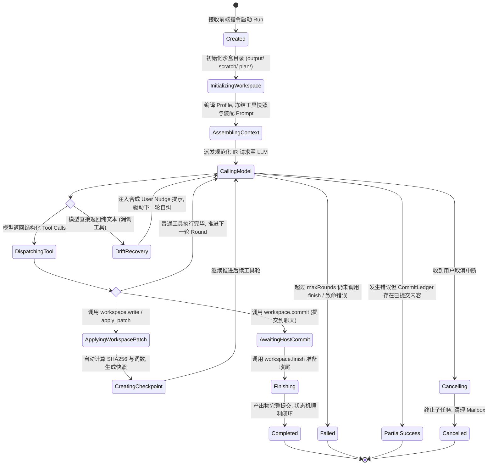
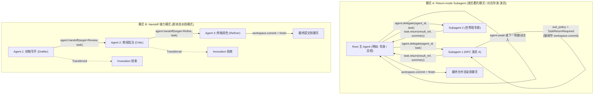
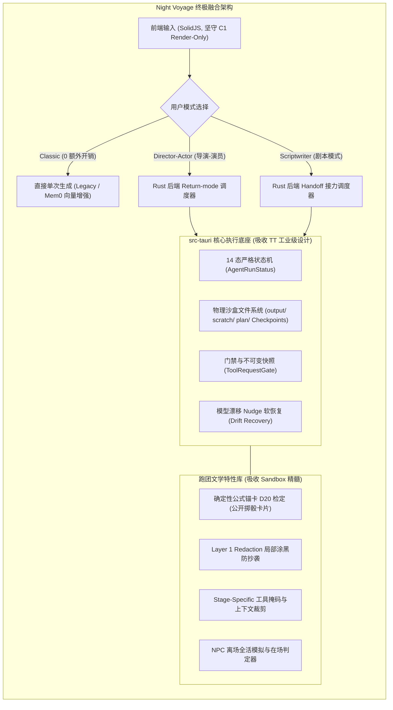

# 外部参考项目（aisandboxgame 与 TauriTavern）Agent 架构与执行流程深度剖析全景文档

本文档对两个核心外部参考项目——**`aisandboxgame`（简称 Sandbox）** 与 **`TauriTavern`（简称 TT）** 的源码进行了全面、系统、逐行级别的深度审查与逆向工程。重点梳理：
1. **Agent 模式的完整执行流程与生命周期流转**；
2. **所有存在的 Agent / Subagent 全量清单、提示词指令、工具权限、输入输出契约与副作用职责矩阵**；
3. **两者的架构同构性剖析（Sandbox 如何融合剧本流水线与导演演员模式）**；
4. **对 Night Voyage 项目（Tauri 2.0 + Rust 核心 + SolidJS 宿主）的终极落地架构指导**。

---

# 第一部分：AI Sandbox Game (aisandboxgame) 架构全貌与执行流程

## 1. 架构定位与双引擎演进概览

`aisandboxgame` 是一个纯浏览器运行的文字沙盒 TRPG 跑团游戏。其核心哲学是：**完全放弃无状态对话（Stateless Chat）**，所有玩家交互（输入打字、选项点击、掷骰指令）必须作为推动沙盒演进的一个回合（Turn），进入严格编排的 Game Master / Agent 状态机。

在源码演进中，Sandbox 存在两代截然不同的 Agent 实现范式：
1. **第一代：并行 ReAct 流水线（Parallel ReAct Pipeline）**：实现于 [`react.js`](file:///d:/data/Night%20Voyage/aisandboxgame-master/js/services/ai/react.js) 与 [`prompt-gm.js`](file:///d:/data/Night%20Voyage/aisandboxgame-master/js/services/ai/prompt-gm.js)，通过极度精细的 9 阶段（Iteration 1~9）分阶段工具掩码（Stage-Specific Tool Masking）与并发分支编排。
2. **第二代：PZGM 剧情模式引擎（PZGM Engine Island）**：实现于 [`pzgmStoryController.js`](file:///d:/data/Night%20Voyage/aisandboxgame-master/js/services/pzgmStoryController.js) 与 [`dist/pzgm-engine.js`](file:///d:/data/Night%20Voyage/aisandboxgame-master/dist/pzgm-engine.js)，践行“大脑与皮”（Engine Island vs Host Skin）彻底解耦范式，将整回合逻辑收敛为纯确定性状态机与结构化 JSON 产出。

```mermaid
flowchart TD
    UserInput["玩家输入 / 选项点击 / 掷骰"] --> Router{"StoryEngineFlag.isPzgm()"}

    subgraph Gen1["第一代: 并行 ReAct 流水线 (react.js)"]
        G1_P1["Phase 1: OOC 意图归一化 Subagent"] --> G1_GM["GM 决策层 (Pace Engine 场景节奏/世界事件)"]
        G1_GM --> G1_Fork["Promise.all (4路高并发区)"]
        
        subgraph G1_Parallel["并发分支区"]
            BranchA["Branch A (Iter 1): 纯叙事 Segment 1 + 声明 Checkpoint"]
            BranchB["Branch B (Iter 2-4): 链式只读代查 (Reads-only chain)"]
            NPCReact["NPC Reaction 群: 独立角色心理/动作决策并发"]
            ActClass["玩家行动分类器: 意图/耗时并发判定"]
        end
        
        G1_Fork --> G1_Parallel
        G1_Parallel --> G1_Merge["Delta 合并与上下文消毒 (Sanitize & BaseLen Alignment)"]
        G1_Merge --> G1_Iter5["Iter 5: 逻辑突变与状态结算 (Mutations: 面板/物品/NPC/骰点)"]
        G1_Iter5 --> G1_L1Redact["Layer 1 Redaction (局部涂黑防抄袭: 50字尾锚)"]
        G1_L1Redact --> G1_Iter6["Iter 6: 承接叙事 Segment 2 + 可选背包微调"]
        G1_Iter6 --> G1_Iter7Gate{"Iter 7: 三分支门禁决策"}
        
        G1_Iter7Gate -->|Rescue: iter6 漏调叙事| G1_Rescue["Rescue 补救子轮: 补写缺失正文"]
        G1_Iter7Gate -->|Closing: 存在未闭合 next_tool| G1_Closing["Closing 闭合: 执行工具 + Segment 3 收尾"]
        G1_Iter7Gate -->|Skip: checkpoint type=none| G1_Skip["直接跳过"]
        
        G1_Rescue --> G1_Iter8["Iter 8: Settlement 并发结算 (panelSkill + inventorySkill 双轨审计)"]
        G1_Closing --> G1_Iter8
        G1_Skip --> G1_Iter8
        
        G1_Iter8 --> G1_Iter9["Iter 9 并发区: update_choices (4层兜底) ‖ him (NPC登场审计)"]
        G1_Iter9 --> G1_Final["Turn 终局: EventBus 广播 + 存档持久化"]
    end

    subgraph Gen2["第二代: PZGM 剧情模式引擎 (pzgmStoryController.js)"]
        PZ_Pre["Pre-Turn: Starter 开局主角/地点解析 + OOC 拆分 + 世界事件指令桥"] --> PZ_S0["Stage Open (S0): 意图推理 + D20确定性公开掷骰 + 开场流式叙事"]
        PZ_S0 --> PZ_AuxFork["并发 Aux Subagents (NPC Reaction ‖ 离场全活 ‖ 在场判定 ‖ 记忆摘要)"]
        PZ_S0 --> PZ_Continue["Stage Continue: 承接叙事展开与冲突演绎"]
        PZ_Continue --> PZ_Closeout["Stage Closeout: 单次全量结构化收尾 (面板/物品/改卡/选项)"]
        PZ_AuxFork --> PZ_MergeAux["Aux 结果注入 TurnResult"]
        PZ_Closeout --> PZ_MergeAux
        PZ_MergeAux --> PZ_Out["产出权威 JSON: { turnResult, nextSave }"]
        PZ_Out --> PZ_HostProj["宿主投影: UI 状态栏 / 关系网 / 背包 / SQLite-Store 持久化"]
    end

    Router -->|False| Gen1
    Router -->|True| Gen2
```



---

## 2. 第一代：并行 ReAct 流水线执行全流程 (`react.js`)

在 [`react.js`](file:///d:/data/Night%20Voyage/aisandboxgame-master/js/services/ai/react.js) 中，单回合的推进被精细划分为 9 个步骤，以极高的确定性控制大模型的行为边界：

### 详细阶段剖析

#### Phase 1: OOC 意图归一化 Subagent (`_runOocWorkflow`)
- **执行逻辑**：检测玩家输入中的 `// OOC` 场外指示（如 `// 请让店长对我产生敌意`）。
- **流程**：Round 1 模型评估该指令是直接归一化为 GM 写作指令（`mode: 'commit'`），还是需要向玩家反问澄清（`mode: 'ask_user'`）。若需反问，UI 弹出交互卡片等待玩家回答，进入 Round 2 产出最终归一化指令。
- **目的**：杜绝玩家随手打的脏指令、破防发言或违规设定直接越权污染叙事上下文。

#### Phase 2: GM 决策层 (`_callGM` / `PaceEngine`)
- **执行逻辑**：纯代码与规则判定场景停滞度（Stagnation）、当前时间线事件。
- **产出**：输出场景节奏微调指令（`pacing`）或世界事件播报指令（`BROADCAST_EVENT` / `FORESHADOW`），生成 `gmDirective` 注入后续阶段。

#### Phase 3: `Promise.all` 4 路并发执行区
为压缩单回合延迟，系统在此处并发派发 4 个异构任务：
1. **Branch A (Iteration 1 - 叙事主干)**：
   - 工具掩码：**仅允许 `update_narrative`**。
   - 职责：生成第一段正文（Segment 1），并在参数中强制要求声明 `narrativeCheckpoint: { type, next_tool }`（例如：声明接下来需要掷骰或扣血）。
2. **Branch B (Iteration 2~4 - 链式只读代查)**：
   - 工具掩码：**仅允许只读检索工具**（`read_lorebook`, `search_archive`, `inspect_environment` 等）。
   - 循环：最多跑 3 轮。每轮末尾模型若返回 0 工具调用则提前终止。模型在此阶段收集世界设定与前序知识。
3. **NPC Reaction 独立子代理群 (`_runNpcReactionCalls`)**：
   - 并行调用：对当前在场的每一个 NPC，各派发一次独立的轻量模型调用。
   - 职责：分别计算各自角色的心理状态、对玩家行为的即时态度、内心独白与动作。
4. **玩家行动意图分类器 (`preparePendingPlayerActionContext`)**：
   - 职责：语义分析玩家本轮动作类型（战斗、交涉、探索）与粗估时间消耗（分钟/小时/天）。

#### Phase 4: 并行 Delta 合并与上下文消毒
- **对齐截断**：通过 `baseLen` 准确截取 Branch A 的 delta 消息与 Branch B 的 delta 消息，拼装统一的 `unifiedMessages`。
- **Checkpoint 校验**：解析 Iter 1 产出的 `narrativeCheckpoint`。如果 `type === 'none'` 且未声明 `next_tool`，系统判定本回合为纯叙事回合，**直接跳过 Iter 5、6、7，直通 Iter 8**。

#### Phase 5: Iteration 5 逻辑突变与状态结算 (Mutations)
- **工具掩码**：开放 `update_item`、`update_panel`、`update_npc`、`load_predefined_npc`、`get_roll` 等修改状态的工具；**绝对禁止 `update_narrative` 与 `update_choices`**。
- **职责**：履行 Iter 1 在 checkpoint 中立下的承诺，严格执行数值扣除、道具增减、NPC 好感度变更与骰点检定。**不写一字正文，只做世界状态突变**。

#### Phase 6: Iteration 6 承接叙事生成 (Segment 2) 与 Layer 1 Redaction 防抄袭
- **核心机制 —— Layer 1 Redaction（局部涂黑防抄袭）**：
  - **痛点**：在多阶段长链条中，小模型或弱模型在生成 Segment 2 时，由于上下文中存在完整的 Segment 1，经常会逐字机械复读 Segment 1 的内容，造成严重的自抄袭与文本冗余。
  - **实现**：在向模型组装 Iter 6 提示词前，调用 `_redactNarrativeForRescue(messages, 50)`，把历史中所有已生成的 `update_narrative.text` 替换为占位符 `[前文叙事已在此处定稿]`，**仅保留末尾不超过 50 字作为续写锚点**。
  - **还原**：Iter 6 执行完成后，立刻调用 `restore()` 还原真实文本，确保后续阶段及存档不受涂黑影响。
- **职责**：结合 Iter 5 的数值突变结果（例如骰点成功或失败、道具消耗），生成第二段发展叙事（Segment 2）。

#### Phase 7: Iteration 7 三分支门禁闭合 (Rescue / Closing / Skip)
- **分支 1（Rescue 模式）**：若 Iter 6 违约漏掉了 `update_narrative` 调用，在此强制启动补救子轮，命名强制锁定 `update_narrative` 补全正文。
- **分支 2（Closing Resolve 模式）**：若 Iter 6 声明了后续收尾工具（`iter6NextTool`），在此强制同时调用该工具与最后的收尾段落（Segment 3）。
- **分支 3（Skip 模式）**：若 Iter 6 的 checkpoint 标明 `type === 'none'`，直接跳过。

#### Phase 8: Iteration 8 兜底结算 Subagents (`panelSkill` & `inventorySkill`)
- **执行逻辑**：在主循环可能存在工具漏调的情况下，启动独立的结算子代理：
  - [`panelSkill.js`](file:///d:/data/Night%20Voyage/aisandboxgame-master/js/skills/panelSkill.js)：通读本回合累积的全部正文，判断时间流逝、地点变迁与自定义属性组（健康、魔力、声望），调用 `update_panel`。
  - [`inventorySkill.js`](file:///d:/data/Night%20Voyage/aisandboxgame-master/js/skills/inventorySkill.js)：**双轨审计机制**。仅当主循环在本回合调用 `update_item` 的次数为 0 时启动。从叙事全文中逆向提取玩家获得的装备、消耗的金钱，补调 `update_item`。

#### Phase 9: Iteration 9 动态选项生成与 NPC 登场审计
- **并行执行**：
  1. **选项生成器 (`_runChoicesIteration`)**：只暴露 `update_choices` 工具，生成 3~4 个兼具逻辑因果与文学色彩的动态行动选项，内置 4 层防崩溃熔断（L1 结构化解析 $\rightarrow$ L2 代码块提取 $\rightarrow$ L3 历史备选 $\rightarrow$ L4 本地硬编码保底）。
  2. **NPC 登场审计 Subagent (`_runNpcIntroAuditSubagent`，代号 him)**：由强思考模型阅读本回合最终定稿叙事，审计文本中是否出现了新的重要角色，自动触发 `new_npc` 或 `load_predefined_npc` 完成建卡与关系网绑定。

---

## 3. 第二代：PZGM 剧情模式引擎执行全流程 (`pzgmStoryController.js`)

第一代 ReAct 虽然控制精细，但单回合涉及多次 API 交互，Token 消耗动辄数万，且客户端网络脆弱。第二代 **PZGM（Project Zero Game Master）引擎** 重塑了执行流：

```
PZGM 单回合三阶段流水线:
┌────────────────────────────────────────────────────────────────────────────────────────┐
│ Pre-Turn 准备阶段:                                                                     │
│  - Starter 开局主角/出生点解析 (Turn 1 专属, 锁定主角卡与地点)                          │
│  - OOC 拆分: 导演指令 [!CRITICAL] 注入输入末尾; 玩家闲聊进归一化                         │
│  - 世界事件 Directive 桥: paceEngine 计算时间线播报事件注入 directives.gm              │
└───────────────────────────────────────────┬────────────────────────────────────────────┘
                                            │
                                            ▼
┌────────────────────────────────────────────────────────────────────────────────────────┐
│ Stage Open (S0 / 开场阶段):                                                            │
│  - 意图推理: 解析玩家输入的核心动作与目标                                              │
│  - 确定性 D20 掷骰: 引擎内核公开运行掷骰算法 (Kind: d20 / coin / ai_score / chance)     │
│  - 流式叙事段 1: 结合掷骰结果实时推送开场段落 (narrative_stream)                        │
└─────────────────────┬──────────────────────────────────────────────────────────────────┘
                      │
                      ├──────────────────────────────────────────┐
                      ▼                                          ▼ (后台并发)
┌──────────────────────────────────────────────┐   ┌─────────────────────────────────────┐
│ Stage Continue (承接阶段):                   │   │ 伴生 Aux Subagents 并发池:          │
│  - 深入展开剧情冲突与情境变化                │   │  - NPC Reaction (在场 NPC 实时反应) │
│  - 处理多角色在场互动                        │   │  - NPC Offscreen (离场 NPC 全活演进)│
│  - 输出承接叙事流 (narrative_display)        │   │  - Presence Triage (在场判定器)     │
└─────────────────────┬────────────────────────┘   │  - Memory Summary (回合长程摘要)    │
                      │                            └──────────────────┬──────────────────┘
                      ▼                                               │
┌──────────────────────────────────────────────┐                      │
│ Stage Closeout (收尾阶段):                   │                      │
│  - 单次大模型结构化 JSON 产出:               │                      │
│    * settlement: 时间、地点、目标演化        │                      │
│    * item_changes: 物品/货币获取与消耗增量   │                      │
│    * npc.card_proposals: NPC 卡片增量变更    │                      │
│    * choices: 3~4 个后继行动分支             │                      │
└─────────────────────┬────────────────────────┘                      │
                      │                                               │
                      ▼                                               │
┌─────────────────────────────────────────────────────────────────────▼──────────────────┐
│ Host 投影阶段 (pzgmStoryController.js):                                                │
│  - 汇总结算结果: { turnResult, nextSave }                                              │
│  - 投影至现有 Store: npcStore / inventoryStore / timelineService / locationTracker    │
│  - 随 autoSaveGame 存入 SQLite (ServiceRegistry 'pzgmState')                           │
└────────────────────────────────────────────────────────────────────────────────────────┘
```

---

## 4. Sandbox 完整 Agent / Subagent 全量清单与职责矩阵

在 `aisandboxgame` 代码库中，共存在 **12 个明确分工的专用 Agent / Subagent**：

| 序号 | Agent 标识 / 文件 | 核心职责 | 触发时机 | 提示词指令规范 (Prompt Directive) | 允许工具权限 | 输出契约与副作用 |
| :--- | :--- | :--- | :--- | :--- | :--- | :--- |
| **1** | **OOC Normalizer Subagent**<br>[`npc-ooc.js: _runOocWorkflow`](file:///d:/data/Night%20Voyage/aisandboxgame-master/js/services/ai/npc-ooc.js) | 提取玩家场外输入（`// OOC`），归一化为纯净 GM 写作指令或反问澄清 | 回合开始前，检测到玩家输入含 OOC 时触发 | 严格区分场内叙事与场外调试，禁止将越权发言作为角色台词，必要时生成提问 | 无工具（纯文本/结构化 JSON：`{mode: "commit"\|"ask_user", directive, question}`） | 输出归一化指令挂载至 `directives.ooc`；若反问则中断流程等待用户输入 |
| **2** | **Pace Engine / GM Decision**<br>[`paceEngine.js`](file:///d:/data/Night%20Voyage/aisandboxgame-master/js/services/paceEngine.js) & [`prompt-gm.js: _callGM`](file:///d:/data/Night%20Voyage/aisandboxgame-master/js/services/ai/prompt-gm.js) | 场景停滞度判定、世界大事件时间线播报、剧情节奏干预 | 回合开始前，在 OOC 之后、主叙事之前 | 评估场景轮数，若连续停滞则下达强制推进（FORCE）或建议转场（SUGGEST_MOVE） | 无工具（输出指令对象 `{action, event_summary, directive}`） | 注入 `directives.gm` 与 `directives.pacing`，驱动主叙事推进 |
| **3** | **Iter 1 Narrative Spine Agent**<br>[`react.js: Iter 1 Branch A`](file:///d:/data/Night%20Voyage/aisandboxgame-master/js/services/ai/react.js) | 生成开篇正文 Segment 1，并强制规划后续逻辑检查点 | 回合主循环第一步（与 Branch B 并发） | 仅专注文学叙事展开，禁止执行状态修改，必须显式声明 checkpoint | 仅允许 `update_narrative` | 产出正文流式输出；参数声明 `narrativeCheckpoint` 决定是否需要后继 Iter 5~7 |
| **4** | **Iter 2~4 Read Chain Agent**<br>[`react.js: Iter 2~4 Branch B`](file:///d:/data/Night%20Voyage/aisandboxgame-master/js/services/ai/react.js) | 代表主模型检索世界书、历史档案与环境细节 | 与 Iter 1 并行启动，最多循环 3 轮 | 扮演只读调查员，根据玩家输入查找未知概念，无需求时返回空工具调用退出 | 仅允许只读工具（`read_lorebook`, `search_archive`, `inspect_environment`） | 产出只读上下文 Tool Results，合并进主对话历史 |
| **5** | **NPC Persona Decision Agent**<br>[`npc-ooc.js: _callSingleNpcReaction`](file:///d:/data/Night%20Voyage/aisandboxgame-master/js/services/ai/npc-ooc.js) | 模拟单个 NPC 的独立意志、内心独白、社交态度与行动 | 与 Iter 1/2 并发，为每个在场 NPC 独立调用 | 严格基于该 NPC 专属人设卡、记忆与心理状态，第一人称输出反应，不代玩家决定 | 无工具（输出结构化 JSON：`{action, location, mood, inner_thought, text}`） | 产出实时反应气泡（`AI_NPC_REACTION_LIVE`），落地 NPC 状态与记忆 |
| **6** | **NPC Card Sync Subagent**<br>[`npcCardSyncSubagent.js`](file:///d:/data/Night%20Voyage/aisandboxgame-master/js/services/ai/npcCardSyncSubagent.js) | 审计所有 NPC 的 reaction 输出，提取身份层持久字段演化 | 在全部 NPC reaction 结束后接力执行 | 检查角色是否换了衣服、改变了立场、获得新称号或发生外貌改变 | 仅允许 `update_npc` | 产生 `update_npc` 调用，修改 NPC 核心角色档案并提交审批队列 |
| **7** | **NPC Casting Audit Subagent ("him")**<br>[`npcIntroAuditSubagent.js`](file:///d:/data/Night%20Voyage/aisandboxgame-master/js/services/ai/npcIntroAuditSubagent.js) | 审计最终正文，识别新登场重要角色并自动建卡 | Iter 9 阶段，与选项生成并发执行 | 通读最终正文与当前已有名单，发现新角色且有互动价值时建卡，区分原创与预定义池 | 允许 `new_npc`, `load_predefined_npc`；严禁 `update_item` | 自动在世界中创建新 NPC 卡片并显示在关系面板中 |
| **8** | **Starter Subagent**<br>[`starterSubagent.js`](file:///d:/data/Night%20Voyage/aisandboxgame-master/js/services/ai/starterSubagent.js) | 开局第一回合专属：锁定玩家扮演的主角人设厚卡与出生地点 | 仅在游戏 Turn 1 引擎生成叙事之前执行 | 语义解析玩家是想扮演作者预设主角还是自定义新身份，从世界地点池中锚定落点 | 仅允许调用 `resolve_starter` | 产出主角全量档案落入 `npcStore`，将开场地点锁入 `playerOpeningLockStore` |
| **9** | **Panel Settlement Subagent**<br>[`panelSkill.js`](file:///d:/data/Night%20Voyage/aisandboxgame-master/js/skills/panelSkill.js) | 终局结算：从叙事文本反推时间推进、空间转移与属性数值变动 | Iter 8 阶段并发启动 | 状态结算专员，严格依照正文事实变动状态，严禁无中生有凭空增加天数 | 仅允许调用 `update_panel` | 更新状态栏时间（年月日时分）、三级地理坐标与健康/魔力等自定义属性组 |
| **10** | **Inventory Audit Subagent**<br>[`inventorySkill.js`](file:///d:/data/Night%20Voyage/aisandboxgame-master/js/skills/inventorySkill.js) | 终局结算：物品与货币变动双轨兜底审计 | Iter 8 阶段并发启动（仅当主循环调用 `update_item` 次数为 0 时激活） | 物品栏审计员，反推正文中发生的所有获得、丢失、购买、消耗道具与金钱 | 仅允许调用 `update_item` | 补发 `update_item` 工具调用，纠正主模型遗漏的背包道具增减 |
| **11** | **NPC Recheck Subagent**<br>[`npcRecheckSubagent.js`](file:///d:/data/Night%20Voyage/aisandboxgame-master/js/services/ai/npcRecheckSubagent.js) | 玩家在 NPC 卡片上点击“复核”时，针对单字段触发即时重判 | 玩家手动点击 UI 触发（独立即时调用，不推进游戏回合） | 仅针对指定角色的指定字段（位置/念头/性格/外貌），结合最近历史剧情重新裁决 | 允许 `recheck_npc_location`, `recheck_npc_field`, `recheck_npc_thought` | 直接更新 NPC 卡片数据与引擎存档，不污染聊天历史 |
| **12** | **Player Status Recheck Subagent**<br>[`playerStatusRecheckSubagent.js`](file:///d:/data/Night%20Voyage/aisandboxgame-master/js/services/ai/playerStatusRecheckSubagent.js) | 玩家在状态栏点击“复核”时，针对当前状态组触发即时重判 | 玩家手动点击 UI 触发（独立即时调用，不推进游戏回合） | 重新评估主角此刻所在地点、当前短期目标或游戏内精确时间 | 允许 `recheck_status_location`, `recheck_status_objective`, `recheck_status_datetime` | 直接校正状态栏与引擎底层时间/地点变量 |

---

# 第二部分：TauriTavern Agent 框架深度解析

## 1. 架构定位与真相（SillyTavern 前端保留 + Rust 后端自研 Agent）

必须彻底澄清 TauriTavern 的真实技术边界：
1. **前端完全保留原版**：TauriTavern **并没有** 用 Rust 重写前端。其前端依然是完整的上游 SillyTavern（HTML + CSS + jQuery + 原生 JS，同步至 1.18.0），目的是 100% 兼容酒馆生态的 Character Card V2/V3、世界书、预设与前端扩展。
2. **后端彻底模块化重写**：原版 SillyTavern 依赖 Node.js（Express 服务端）。TauriTavern 用 **Tauri 2.0 + Rust 彻底重写了整个后端**（拆分为 `tt-domain`、`tt-application`、`tt-ports`、`tt-adapter-*` 等 Crates）。
3. **Agent 体系是 Rust 后端 100% 全新自研**：原版 SillyTavern 没有任何现代 Agent 机制。TauriTavern 在 Rust 后端构建了一套工业级的通用 Agent 运行时（`AgentRuntimeService`、`LoopRunner`、`WorkspaceSandbox`），前端仅通过轻量扩展面板（`src/scripts/extensions/agent-system/`）通过 Tauri IPC 做状态订阅与渲染展示。

---

## 2. 状态机推进与执行流程 (The 14-State Lifecycle)

在 [`loop_runner.rs`](file:///d:/data/Night%20Voyage/TauriTavern-main/src-tauri/crates/tt-application/src/services/agent_runtime_service/loop_runner.rs) 与 [`executor.rs`](file:///d:/data/Night%20Voyage/TauriTavern-main/src-tauri/crates/tt-application/src/services/agent_runtime_service/executor.rs) 中，单次 `AgentRun` 受到一个极其严密的 14 状态状态机管理：



### 核心机制：模型漂移软恢复 (Drift Recovery & Soft Nudge)
在长链 Agent 运行中，大模型经常出现“直接输出小说正文，但漏掉了 `workspace.commit` 与 `workspace.finish` 工具调用”的契约漂移问题。
- **传统粗暴处理**：直接报错导致整个回合崩溃。
- **TauriTavern 的工业级软自愈 (`loop_runner.rs:132-191`)**：
  1. 系统检测到模型输出的 `tool_calls` 为空，但当前轮数 `round < max_rounds`；
  2. 系统**不报错**，递增 `drift_recovery_attempts`；
  3. 将模型的直接文本暂存至沙盒文件，并将该条 `assistant` 输出正式推入历史；
  4. 系统自动追加一条**合成的 `user` 提示（Nudge）**：“*检测到你直接输出了文本，请按照契约调用相应的 Agent 工具完成落地或收尾*”；
  5. 驱动模型在下一轮自主改正并调用工具。

---

## 3. 双重多 Agent 协同体系：Return-mode Subagent 与 Handoff

TauriTavern 在 Rust 核心层原生实现了两种各司其职的多代理协作模型：



### 3.1 模式 A：Return-mode Subagent（委托-返回型 / 对应导演-演员）
- **核心工具**：`agent.list`, `agent.delegate`, `agent.await`, `task.return`。
- **机制与安全红线**：
  - 主 Agent 调用 `agent.delegate` 为指定 Profile 创建子任务。
  - 子任务由 run-scoped 后台调度器（Scheduler）并行驱动。
  - **权限硬隔离**：子 Agent 的 Invocation 带有 `exit_policy = TaskReturnRequired`。子 Agent **被硬性剥夺了 `workspace.commit` 和 `workspace.finish` 工具**，绝不能越权篡改主聊天记录，只能通过 `task.return` 返回中间产物。
  - **主 Agent 接收**：主 Agent 可通过 `agent.await` 主动等待，或者在下一轮工具循环中由系统自动将已完成的子任务注入上下文。

### 3.2 模式 B：Handoff 接力模式（对应剧本编排流水线）
- **核心工具**：`agent.handoff`。
- **机制与安全红线**：
  - 当前拥有者调用 `agent.handoff` 将控制权转移给下一个 Profile（如从写手转给审阅者）。
  - 当前 Invocation 状态变为 `Transferred` 并退出，目标 Agent 在同一个 `AgentRun` 内接管工作区。
  - 最终接管者有权读取前序沙盒产物、执行修改，并最终调用 `workspace.commit` 与 `workspace.finish`。
  - Profile 中设有 `maxHandoffDepth`（默认 8），防止递归接力死循环。

---

## 4. 沙盒工作区文件系统与 Checkpoint 机制 (`WorkspaceSandbox`)

每个 `AgentRun` 拥有一个完全隔离的虚拟工作区文件系统（[`tt-domain/src/models/agent/mod.rs`](file:///d:/data/Night%20Voyage/TauriTavern-main/src-tauri/crates/tt-domain/src/models/agent/mod.rs)）：
1. **虚拟根目录分区**：
   - `output/`：最终交付物（如 `output/main.md`）。
   - `scratch/`：草稿与计算暂存。
   - `plan/`：任务规划与步骤拆解。
   - `summaries/`：阶段性长文本摘要。
   - `persist/`：跨回合保留的世界/故事持久态。
2. **路径穿越防御 (`WorkspacePath`)**：
   - 严禁绝对路径、盘符（`C:\`）、`..` 上卷路径与 NUL 字符。
3. **自动快照 (`Checkpoint`)**：
   - 任何针对文件的 `workspace.write_file` 或 `workspace.apply_patch`，底层均会自动计算 SHA256 哈希与字符统计，落库 Checkpoint 记录，实现无损版本回退。

---

## 5. TauriTavern 完整 Profile 模型与 19 个原生内置工具矩阵

### 5.1 Profile 策略模型 (`AgentProfileDefinition`)
TauriTavern 的每一个 Agent 均由严密的声明式配置驱动（[`profile.rs`](file:///d:/data/Night%20Voyage/TauriTavern-main/src-tauri/crates/tt-domain/src/models/agent/profile.rs)）：
- `id` / `displayName` / `description`
- `preset` (`AgentPresetBinding`): 绑定酒馆预设
- `model` (`AgentModelBinding`): 绑定独立连接与模型
- `run` (`AgentRunPolicy`): 前台/后台运行、模型重试策略
- `context` (`AgentContextPolicy`): 历史消息读取深度、是否加载世界书
- `delegation` (`AgentDelegationPolicy`): 能否派发、能否转交、最大并发数、最大深度
- `tools` (`AgentToolPolicy`): 白名单 `allow`、黑名单 `deny`、每轮预算 `maxRounds`
- `workspace` (`AgentWorkspacePolicy`): 可视根目录与可写根目录权限
- `output` (`AgentOutputPolicy`): 产物装配规则

### 5.2 19 个原生内置工具分类表

| 分类 | 工具原生名称 | 权限约束与说明 |
| :--- | :--- | :--- |
| **Agent 协同** | `agent.list` | 列出当前可委托或可接力的所有 Agent Profile |
| | `agent.delegate` | 派发子任务给指定 Profile（Return 模式） |
| | `agent.handoff` | 将控制权转交接力给下一个 Profile（Handoff 模式） |
| | `agent.await` | 阻塞等待正在执行的子任务结果 |
| | `task.return` | **子 Agent 专用**：提交任务结论，闭环退出 |
| **工作区文件** | `workspace.list_files` | 列出可见沙盒根目录下的文件清单 |
| | `workspace.search_files`| 在沙盒文件中检索特定关键字 |
| | `workspace.read_file` | 读取沙盒文件内容（带行号） |
| | `workspace.write_file`| 写入或追加沙盒文件 |
| | `workspace.apply_patch`| 基于旧文本哈希精确替换修改沙盒文件 |
| | `workspace.commit` | **前台专用**：将沙盒文件内容正式提交发布到主聊天记录 |
| | `workspace.finish` | **前台专用**：标记任务圆满结束（要求此前至少 commit 过一次） |
| **聊天与历史** | `chat.search` | 语义检索过往的聊天记录与历史剧情 |
| | `chat.read_messages` | 按范围读取指定条数的历史消息上下文 |
| **世界观设定** | `worldinfo.read_activated` | 读取当前由于关键词命中而被激活的世界书条目 |
| **技能库** | `skill.list` | 列出当前可见的自定义技能清单 |
| | `skill.search` | 检索可用技能 |
| | `skill.read` | 读取特定技能的说明与脚本 |
| **随机跑团** | `dice_roll` | 基础随机数与投骰工具 |

---

# 第三部分：两项目核心机制深度对照与同构性洞察

```
对照矩阵:
┌─────────────────────┬───────────────────────────────────────────┬───────────────────────────────────────────┐
│ 维度                │ aisandboxgame (Sandbox)                   │ TauriTavern (TT)                          │
├─────────────────────┼───────────────────────────────────────────┼───────────────────────────────────────────┤
│ 底座形态            │ 纯前端 JavaScript 浏览器单机应用          │ Tauri 2.0 + Rust 核心 (C1 前端只渲染)     │
│ 对话范式            │ 全面强制 Agent 化，废黜无状态对话         │ 双模式解耦：保留传统无状态，可选开 Agent  │
│ 多代理模式          │ 9 阶段硬编码流水线 + 并发 Subagents       │ 形式化两大正交模式：Return 委托 + Handoff  │
│ 数据与文件隔离      │ 散落在全局 JS Store 与引擎内存中          │ 严密物理沙盒 WorkspaceSandbox + Checkpoint│
│ 权限控制            │ 阶段性工具掩码 (Stage-Specific Masking)   │ 编译期不可变工具快照 (InvocationSnapshot) │
│ 防抄袭/防漂移       │ Layer 1 Redaction (局部涂黑 50 字尾锚)    │ Drift Recovery (合成 User Nudge 自我纠偏) │
│ 跑团规则系统        │ 深度整合：D20 确定性检定、全活离场模拟    │ 通用创作：仅提供基础 dice_roll 工具       │
└─────────────────────┴───────────────────────────────────────────┴───────────────────────────────────────────┘
```

### 深度同构性洞察：为什么说“Sandbox 是 TauriTavern 两种模式的结合体”？
审查代码后发现一个极其精妙的同构现象：
1. **Sandbox 的流水线本质上就是 Handoff（剧本流水线）**：
   Sandbox 的 Iter 1（写手）$\rightarrow$ Iter 5（数值师）$\rightarrow$ Iter 6（润色）$\rightarrow$ Iter 7（校对），在概念上完全等价于 TauriTavern 的 `Drafter` $\rightarrow$ `Critic` $\rightarrow$ `Refiner` 之间的 Handoff 接力。
2. **Sandbox 通过 Layer 1 Redaction 实现了 Director-Actor（导演-演员）的信息防火墙**：
   在标准 Handoff 中，下游往往看到上游的所有文字，导致小模型容易抄袭复读；而在导演-演员模式中，演员只能看到受限的局部指令。Sandbox 创造性地在 Iter 6 和 Iter 7 中引入了 **Layer 1 Redaction**——在向润色阶段派发任务时，强行把上游写手的正文涂黑，只留 50 字尾锚。**这在实质上将一个 Handoff 流水线转变为了一种具备“信息防火墙”的变相委托隔离**！

---

# 第四部分：对 Night Voyage 项目的终极映射与落地指南

结合 Night Voyage 的技术基准（`Tauri 2.0 + Rust` 后端 + `SolidJS` 前端 + 严苛的 C1~C7 约束），我们制定以下终极落地映射指南：



### 1. 坚决捍卫 C1 约束（前端只渲染，后端负责一切）
- **绝不学 Sandbox 把状态机和复杂调度写在前端 JavaScript 中**。Sandbox 纯前端的 9-Iteration 代码存在海量的 `try/catch` 泥潭与竞态风险，且极难维护。
- **完全采纳 TauriTavern 的架构**：将 `AgentRun` 状态机推进、多代理 Scheduler、沙盒文件系统、Checkpoint 生成全部编写在 `src-tauri/src/agent/` 纯 Rust 核心内。SolidJS 宿主仅通过 Tauri Event 监听状态跃迁并进行纯响应式渲染。

### 2. 模式 A 与 模式 B 在 Night Voyage 中的精确映射
- **导演-演员模式（Director-Actor） $\rightarrow$ 映射为 Return-mode Subagent**：
  - 主导演拥有全局世界观与全场记忆。
  - 主导演调用 `agent.delegate` 为每一个出场 NPC 派发演员子任务（限定其角色卡与局部见闻）。
  - NPC 演员带有 `TaskReturnRequired` 策略，**硬性剥夺其提交主聊天记录的权力**，仅通过 `task.return` 提交台词与心理独白。
  - 主导演汇总演员台词，编织成最终戏剧正文。
- **剧本模式（Scriptwriter） $\rightarrow$ 映射为 Handoff 接力模式**：
  - 初稿 Agent 生成草稿，写入 `scratch/draft.md` $\rightarrow$ `handoff` 到审阅 Agent 提出批注 $\rightarrow$ `handoff` 到精修 Agent 结合 **Layer 1 Redaction** 润色，最终调用 `workspace.commit` 发布。

### 3. 吸收 Sandbox 的跑团文学精髓
- **确定性 D20 掷骰卡片**：避免大模型随口胡诌胜负，在 Rust 端执行确定性骰点与属性修正计算，通过公开卡片渲染。
- **Layer 1 Redaction 防自抄袭机制**：在剧本模式多轮修改或分段承接时，对历史前文实施局部遮蔽（保留 50 字尾锚），彻底根治小模型逐字复读前文的固有缺陷。
- **阶段性工具掩码 (Stage-Specific Tool Masking)**：根据不同的阶段（思考、突变、叙事、收尾），动态冻结互斥工具箱，从协议层面杜绝模型在写正文时误调背包的幻觉。

### 4. 落地限制与风控红线
- **模式自由可选（保留 Classic 模式）**：不搞 Sandbox 的“全盘强制 Agent”，普通闲聊与低配 API 依然提供 0 状态机开销、0 额外延迟的 Classic 模式。
- **Token 暴增警示**：当导演模式、剧本模式或 MEM0 组合开启时，在前端醒目展示红字预警，保障用户的成本知情权。
