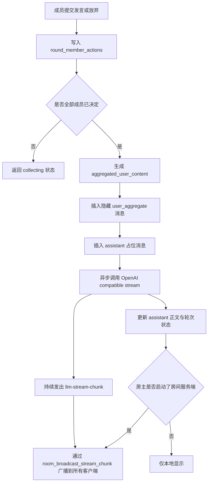
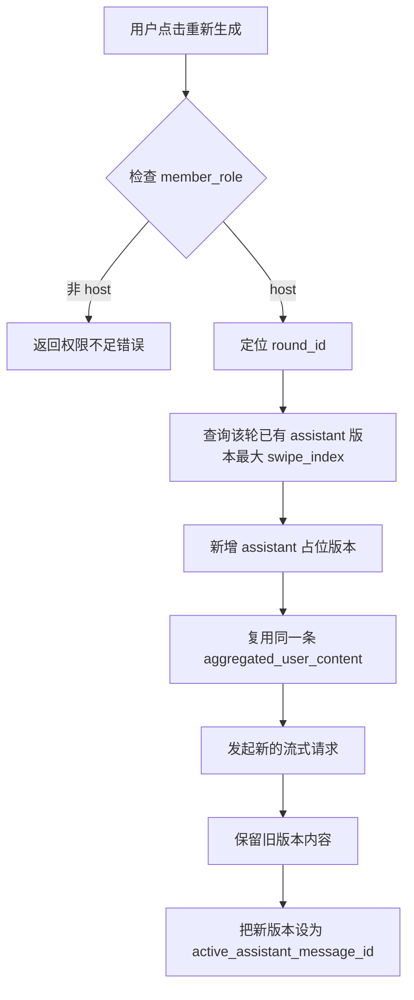

# Night Voyage Backend AI Handoff

## 一 核心数据模型

### conversations

| 字段 | 类型 | 说明 |
|------|------|------|
| id | INTEGER PK | |
| title | TEXT | |
| conversation_type | TEXT | `single` / `online` |
| host_character_id | INTEGER FK -> character_cards | |
| world_book_id | INTEGER FK -> world_books | |
| preset_id | INTEGER FK -> presets | |
| created_at | INTEGER | |
| updated_at | INTEGER | |

### conversation_members

| 字段 | 类型 | 说明 |
|------|------|------|
| id | INTEGER PK | |
| conversation_id | INTEGER FK -> conversations | |
| character_id | INTEGER FK -> character_cards | 可为 NULL，表示真人玩家 |
| display_name | TEXT | 前端展示名 |
| member_role | TEXT | `host` / `player` |
| join_order | INTEGER | |
| is_active | INTEGER | 0/1 |
| created_at | INTEGER | |

### rooms

| 字段 | 类型 | 说明 |
|------|------|------|
| id | INTEGER PK | |
| room_name | TEXT | |
| host_address | TEXT | 房主 IP |
| host_port | INTEGER | 房主监听端口 |
| status | TEXT | `waiting` / `playing` / `closed` |
| current_player_count | INTEGER | 当前玩家数 |
| passphrase | TEXT | 可选密码 |
| character_id | INTEGER FK -> character_cards | |
| conversation_id | INTEGER FK -> conversations | |
| max_players | INTEGER | 默认 4 |
| created_at | INTEGER | |

### messages

| 字段 | 类型 | 说明 |
|------|------|------|
| id | INTEGER PK | |
| conversation_id | INTEGER FK -> conversations | |
| round_id | INTEGER FK -> chat_rounds | 可为 NULL |
| member_id | INTEGER FK -> conversation_members | 可为 NULL |
| role | TEXT | `user` / `assistant` / `system` |
| message_kind | TEXT | `user_visible` / `user_aggregate` / `assistant_visible` |
| content | TEXT | 正文 |
| reply_to_id | INTEGER FK -> messages | 可为 NULL |
| is_swipe | INTEGER | 0/1 |
| swipe_index | INTEGER | |
| is_active_version | INTEGER | 0/1 |
| created_at | INTEGER | |

### chat_rounds

| 字段 | 类型 | 说明 |
|------|------|------|
| id | INTEGER PK | |
| conversation_id | INTEGER FK -> conversations | |
| round_number | INTEGER | 从 1 开始 |
| state | TEXT | `collecting` / `streaming` / `completed` / `failed` |
| active_assistant_message_id | INTEGER FK -> messages | 可为 NULL |
| created_at | INTEGER | |
| completed_at | INTEGER | 可为 NULL |

### round_member_actions

| 字段 | 类型 | 说明 |
|------|------|------|
| id | INTEGER PK | |
| round_id | INTEGER FK -> chat_rounds | |
| member_id | INTEGER FK -> conversation_members | |
| action_type | TEXT | `spoken` / `skipped` |
| content | TEXT | 可为 NULL（当 skipped） |
| created_at | INTEGER | |

## 二 核心命令

### `conversations_create`

```ts
type CreateConversationRequest = {
  title: string;
  conversationType: 'single' | 'online';
  hostCharacterId: number;
  worldBookId?: number;
  presetId?: number;
};
```

### `chat_submit_input`

```ts
type ChatSubmitInputRequest = {
  conversationId: number;
  memberId: number;
  actionType: 'spoken' | 'skipped';
  content?: string;
};
```

```ts
type ChatSubmitInputResult = {
  round: RoundState;
  action: {
    memberId: number;
    actionType: 'spoken' | 'skipped';
    content: string;
  };
  visibleUserMessage?: UiMessage;
  assistantMessage?: UiMessage;
  autoDispatched: boolean;
};
```

### `regenerate_message`

```ts
type RegenerateMessageRequest = {
  conversationId: number;
  memberId: number;
  providerId: number;
  replyToId: number;
};
```

**权限控制**：`memberId` 对应的 `member_role` 必须为 `host`，否则返回 `"权限不足：只有房主可以执行此操作"`。

### `chat_regenerate_round`

```ts
type ChatRegenerateRoundRequest = {
  conversationId: number;
  memberId: number;
  roundId: number;
};
```

**权限控制**：`memberId` 对应的 `member_role` 必须为 `host`，否则返回 `"权限不足：只有房主可以执行此操作"`。

### `messages_update_content`

```ts
type MessagesUpdateContentRequest = {
  conversationId: number;
  memberId: number;
  messageId: number;
  content: string;
};
```

**权限控制**：`memberId` 对应的 `member_role` 必须为 `host`，否则返回 `"权限不足：只有房主可以执行此操作"`。

### `messages_list`

```ts
type UiMessage = {
  id: number;
  conversationId: number;
  roundId?: number;
  memberId?: number;
  role: 'user' | 'assistant' | 'system';
  messageKind: 'user_visible' | 'assistant_visible';
  content: string;
  displayName?: string;
  isSwipe: boolean;
  swipeIndex: number;
  replyToId?: number;
  createdAt: number;
};
```

### `round_state_get`

```ts
type GetRoundStateRequest = {
  conversationId: number;
};
```

## 三 房间管理命令

### `room_create`

```ts
type RoomCreateRequest = {
  roomName: string;
  conversationId: number;
  port: number;
  passphrase?: string;
};

type RoomCreateResult = {
  roomId: number;
  hostAddress: string;
  port: number;
};
```

### `room_join`

```ts
type RoomJoinRequest = {
  hostAddress: string;
  port: number;
  displayName: string;
};

type RoomJoinResult = {
  success: boolean;
  message: string;
};
```

### `room_leave`

无参数，断开当前客户端连接。

### `room_close`

无参数，房主关闭房间服务端，通知所有客户端。

### `room_send_message`

```ts
type RoomSendMessageRequest = {
  content: string;
  actionType: string;
  displayName: string;
  memberId: number;
};
```

### `room_broadcast_stream_chunk`

```ts
type RoomBroadcastStreamChunkRequest = {
  conversationId: number;
  roundId: number;
  messageId: number;
  delta: string;
  done: boolean;
};
```

### `room_broadcast_round_state`

```ts
type RoomBroadcastRoundStateRequest = {
  roundState: RoundState;
};
```

## 四 角色卡管理

### `character_cards_list`

```ts
type CharacterCardListRequest = {
  cardType?: 'npc' | 'player';
};

type CharacterBaseSection = {
  id: number;
  characterId: number;
  sectionKey: 'identity' | 'persona' | 'background' | 'rules' | 'custom';
  title?: string;
  content: string;
  sortOrder: number;
  createdAt: number;
  updatedAt: number;
};

type CharacterCard = {
  id: number;
  cardType: 'npc' | 'player';
  name: string;
  description: string;
  tags: string[];
  baseSections: CharacterBaseSection[];
  firstMessages: string[];
  defaultWorldBookId?: number;
  defaultPresetId?: number;
  defaultProviderId?: number;
  createdAt: number;
  updatedAt: number;
};
```

### `character_cards_create`

```ts
type CharacterBaseSectionInput = {
  sectionKey: 'identity' | 'persona' | 'background' | 'rules' | 'custom';
  title?: string;
  content: string;
  sortOrder?: number;
};

type CreateCharacterCardRequest = {
  cardType: 'npc' | 'player';
  name: string;
  description: string;
  tags: string[];
  baseSections?: CharacterBaseSectionInput[];
  firstMessages?: string[];
  defaultWorldBookId?: number | null;
  defaultPresetId?: number | null;
  defaultProviderId?: number | null;
};
```

规则：

- `baseSections` 可用于 `npc` 与 `player`，用于定义角色基础层
- `player` 类型忽略 `firstMessages` 与默认绑定字段
- `npc` 类型允许配置多开局与默认绑定资源
- `baseSections` 缺省时：`create` 视为空数组，`update` 视为保留原有结构化基础段落

### `character_cards_update`

同 `create`，增加 `id`

### `character_cards_delete`

```ts
type DeleteCharacterCardRequest = {
  id: number;
};
```

## 五 世界书管理

### `world_books_list`

```ts
type WorldBook = {
  id: number;
  title: string;
  description?: string;
  entryCount: number;
  createdAt: number;
  updatedAt: number;
};
```

### `world_books_create`

```ts
type CreateWorldBookRequest = {
  title: string;
  description?: string;
};
```

### `world_books_update`

```ts
type UpdateWorldBookRequest = {
  id: number;
  title?: string;
  description?: string;
};
```

### `world_books_delete`

```ts
type DeleteWorldBookRequest = {
  id: number;
};
```

### `world_book_entries_upsert`

```ts
type UpsertWorldBookEntryRequest = {
  worldBookId: number;
  entryId?: number;
  title: string;
  content: string;
  keywords: string[];
  triggerMode: 'any' | 'all';
  isEnabled: boolean;
  sortOrder?: number;
};
```

### `world_book_entries_delete`

```ts
type DeleteWorldBookEntryRequest = {
  entryId: number;
};
```

## 六 预设系统

### `presets_list`

```ts
type PresetSummary = {
  id: number;
  name: string;
  description?: string;
  category: string;
  isBuiltin: boolean;
  version: number;
  temperature?: number;
  maxOutputTokens?: number;
  topP?: number;
  createdAt: number;
  updatedAt: number;
};
```

### `presets_get`

```ts
type PresetPromptBlock = {
  id: number;
  presetId: number;
  blockType: string;
  title?: string;
  content: string;
  sortOrder: number;
  priority: number;
  isEnabled: boolean;
  scope:
    | 'global'
    | 'chat_only'
    | 'group_only'
    | 'single_only'
    | 'completion_only'
    | 'agent_only';
  createdAt: number;
  updatedAt: number;
};

type PresetDetail = {
  preset: PresetSummary;
  blocks: PresetPromptBlock[];
  examples: PresetExample[];
};
```

```ts
type PresetExample = {
  id: number;
  presetId: number;
  role: 'user' | 'assistant';
  content: string;
  sortOrder: number;
  isEnabled: boolean;
  createdAt: number;
  updatedAt: number;
};
```

### `presets_compile_preview`

```ts
type PresetCompilePreview = {
  preset: PresetSummary;
  systemText: string;
  systemBlocks: PresetPromptBlock[];
  exampleMessages: Array<{
    role: 'user' | 'assistant';
    content: string;
  }>;
  params: {
    temperature?: number;
    maxOutputTokens?: number;
    topP?: number;
  };
};
```

### `presets_create`

```ts
type PresetPromptBlockInput = {
  blockType: string;
  title?: string;
  content: string;
  sortOrder?: number;
  priority?: number;
  isEnabled?: boolean;
  scope?:
    | 'global'
    | 'chat_only'
    | 'group_only'
    | 'single_only'
    | 'completion_only'
    | 'agent_only';
};

type CreatePresetRequest = {
  name: string;
  description?: string;
  category?: string;
  temperature?: number;
  maxOutputTokens?: number;
  topP?: number;
  blocks?: PresetPromptBlockInput[];
  examples?: Array<{
    role: 'user' | 'assistant';
    content: string;
    sortOrder?: number;
    isEnabled?: boolean;
  }>;
};
```

### `presets_update`

```ts
type UpdatePresetRequest = CreatePresetRequest & {
  id: number;
};
```

规则：

- `name`、`blocks[].blockType`、`blocks[].content` 不能为空
- `examples[].role` 只允许 `user` 或 `assistant`
- `examples[].content` 不能为空
- `temperature` 必须是有限且 `>= 0` 的数值
- `maxOutputTokens` 必须大于 0
- `topP` 必须在 `(0, 1]`
- `blocks` 和 `examples` 缺省时，`create` 视为空数组，`update` 视为保留原有内容

### 规划中的预设条目治理扩展（待实现）

> 说明：本节先登记即将推进的预设治理能力，当前后端尚未落地这些字段；在对应 phase 合入前，实际命令契约仍以现有实现为准。详细方案见 [`plans/preset-governance-plan.md`](plans/preset-governance-plan.md) 与 [`docs/preset-system-architecture.md`](docs/preset-system-architecture.md)。

```ts
type GovernedPresetPromptBlock = PresetPromptBlock & {
  isLocked: boolean;
  lockReason?: string;
  exclusiveGroupKey?: string;
  exclusiveGroupLabel?: string;
};

type GovernedPresetPromptBlockInput = PresetPromptBlockInput & {
  isLocked?: boolean;
  lockReason?: string;
  exclusiveGroupKey?: string;
  exclusiveGroupLabel?: string;
};
```

规划规则：

- 条目锁是编辑期约束，不改变 Prompt Compiler 运行时的 block 编译顺序与注入层级
- 同一 `presetId` 内，相同 `exclusiveGroupKey` 且 `isEnabled = true` 的 block 最多只能有一个
- 命中互斥冲突时，[`presets_create`](src-tauri/src/commands/presets.rs:132) / [`presets_update`](src-tauri/src/commands/presets.rs:197) 必须显式报错，不允许自动关闭旧项
- 锁定条目的修改、禁用、删除、排序变更都应返回显式错误
- 前端可在保存前做即时校验，但后端必须作为最终裁决层

### 规划中的语义组选项树扩展（待实现）

> 说明：本节登记“单模式语义组选项 + 后端展开物化”方案。它属于预设编辑态与保存态扩展，不改变 Prompt Compiler 运行期只读取结构化结果的原则。详细背景见 [`docs/preset-system-architecture.md`](docs/preset-system-architecture.md)。

目标：

- 前端以统一树形界面展示预设语义组与缩进子项
- 后端在保存时把语义组展开为 `preset_prompt_blocks`、`preset_examples` 与采样参数
- 运行时继续只读取物化后的结构化结果，不在热路径解析语义树

推荐数据层：

- `preset_semantic_groups`
- `preset_semantic_options`

推荐字段方向：

- `preset_semantic_groups`
  - `id`
  - `preset_id`
  - `group_key`
  - `label`
  - `sort_order`
  - `selection_mode`
    - `single`
    - `multiple`
  - `is_enabled`
- `preset_semantic_options`
  - `id`
  - `group_id`
  - `option_key`
  - `label`
  - `depth`
  - `sort_order`
  - `is_selected`
  - `expansion_kind`
    - `blocks`
    - `examples`
    - `params`
    - `mixed`

保存期规则：

- 语义组树只作为编辑模型，不直接进入运行期编译热路径
- [`presets_create`](src-tauri/src/commands/presets.rs:132) 与 [`presets_update`](src-tauri/src/commands/presets.rs:197) 由后端统一执行：
  - 语义树校验
  - 单组选项数量校验
  - 语义项到 blocks / examples / params 的展开
  - 物化结果写入现有预设表
- 若启用语义树扩展，后端仍必须作为唯一展开与裁决层，不允许把展开规则下放到前端

前端约束：

- 统一使用一套树形编辑界面，不新增“小白模式 / 专家模式”切换
- 子项必须支持缩进展示
- 单选组在交互上直接表现为单选，不把互斥冲突暴露成让用户自行排错的体验

自由度原则：

- 不限制预设作者只能使用官方语义组
- 允许作者自定义语义组与子项
- 允许作者继续直接编辑自由 block
- 编译器只关心最终物化结果

### `presets_delete`

规则：

- 若预设仍被 `conversations.preset_id` 或 `character_cards.default_preset_id` 绑定，必须显式报错，不允许静默删除

## 七 API 档案与模型列表

### `providers_list`

返回时不要再把完整密钥原样回给前端，建议改成摘要：

```ts
type ApiProfileSummary = {
  id: number;
  name: string;
  providerKind: 'openai_compatible';
  baseUrl: string;
  modelName: string;
  maxTokens?: number;
  temperature?: number;
  hasApiKey: boolean;
  apiKeyPreview?: string;
  updatedAt: number;
};
```

### `providers_create`

```ts
type CreateApiProfileRequest = {
  name: string;
  baseUrl: string;
  apiKey: string;
  modelName: string;
  maxTokens?: number;
  temperature?: number;
};
```

### `providers_update`

```ts
type UpdateApiProfileRequest = {
  id: number;
  name?: string;
  baseUrl?: string;
  apiKey?: string;
  modelName?: string;
  maxTokens?: number | null;
  temperature?: number | null;
};
```

规则：

- `apiKey` 缺省时表示保持原值
- 不允许把空字符串静默解释成保留原值，空字符串应显式报错

### `providers_delete`

```ts
type DeleteApiProfileRequest = {
  id: number;
};
```

### `providers_test`

用途：用当前档案测试可连通性

### `providers_test_claude_native`

用途：按 Claude 原生 `Messages API` 做专用连通性与响应测试，参数参考 CC Switch 的模型测试配置。

```ts
type ProviderClaudeNativeTestRequest = {
  providerId: number;
  testModel: string;
  testPrompt?: string;
  timeoutSeconds?: number;
  degradedThresholdMs?: number;
  maxRetries?: number;
};

type ProviderClaudeNativeTestResult = {
  ok: true;
  status: number;
  latencyMs: number;
  attemptCount: number;
  degraded: boolean;
  degradedThresholdMs: number;
  model: string;
  responsePreview: string;
};
```

规则：

- 只允许用于 `provider_kind = anthropic`
- 请求固定走 Claude 原生 `POST /v1/messages`
- 使用 provider 档案中已保存的 `base_url` 与 `api_key`
- `testModel` 必填，不依赖档案里的默认 `model_name`
- `testPrompt` 缺省时默认 `Who are you?`
- `timeoutSeconds` 缺省时使用 45 秒
- `maxRetries` 缺省时使用 2，表示最多额外重试 2 次
- `degradedThresholdMs` 仅用于结果标记，不触发静默降级
- 必须输出显式调试日志，记录每次 attempt 的 URL、模型、耗时、状态与错误预览

### `providers_fetch_models`

用途：拉取 `/v1/models`，刷新本地缓存，并返回可选模型列表

```ts
type FetchProviderModelsRequest = {
  providerId: number;
};

type RemoteModel = {
  id: string;
  ownedBy?: string;
};
```

## 八 流式事件契约

### `chat-round-state`

用途：成员提交后更新房间轮次状态

```ts
type ChatRoundStateEvent = RoundState;
```

### `llm-stream-chunk`

沿用现有事件，但补充 `roundId`

```ts
type StreamChunkEvent = {
  conversationId: number;
  roundId: number;
  messageId: number;
  delta: string;
  done: boolean;
};
```

### `llm-stream-error`

```ts
type StreamErrorEvent = {
  conversationId: number;
  roundId: number;
  messageId: number;
  error: string;
};
```

### 房间事件

```ts
type RoomMemberJoinedEvent = {
  memberId: number;
  displayName: string;
};

type RoomMemberLeftEvent = {
  memberId: number;
  displayName: string;
};

type RoomStreamChunkEvent = {
  conversationId: number;
  roundId: number;
  messageId: number;
  delta: string;
  done: boolean;
};

type RoomStreamEndEvent = {
  conversationId: number;
  roundId: number;
  messageId: number;
};

type RoomRoundStateUpdateEvent = {
  roundState: RoundState;
};

type RoomClosedEvent = {
  reason: string;
};

type RoomErrorEvent = {
  code: string;
  message: string;
};
```

事件名称：

- `room:member_joined`
- `room:member_left`
- `room:player_message`
- `room:round_state_update`
- `room:stream_chunk`
- `room:stream_end`
- `room:room_closed`
- `room:error`
- `room:disconnected`

## 九 请求组装顺序

Prompt Compiler V1 不再直接扁平拼接字符串，而是先编译为分层 block，再由 provider adapter 翻译成请求体。

### Compiler Phases

1. 收集输入源
   - `conversations.host_character_id`
   - `conversations.world_book_id`
   - `conversations.preset_id`
   - 当前轮 `user_aggregate`
   - 历史窗口中的 `user_aggregate + 激活 assistant + legacy system`
2. 生成 block
   - `PresetRule`
   - `MultiplayerProtocol`（仅当 `conversation_type = "online"`）
   - `CharacterBase`
   - `WorldBookMatch`
   - `RecentHistory`
   - `CurrentUser`
3. 按固定顺序排序
4. 做预算裁剪
5. 交给 provider adapter 生成真实 `messages[]`

### Block Priority And Compile Order

最终顺序固定为：

1. `PresetRule` (priority 100)
2. `MultiplayerProtocol` (priority 150，仅 online 模式)
3. `CharacterBase` (priority 200)
4. `CharacterStateOverlay`
5. `WorldBookMatch`
6. `PlotSummary`
7. `RetrievedDetail`
8. `ExampleMessage`
9. `RecentHistory`
10. `CurrentUser`

Prompt Compiler V1 当前实际落地的子集：

1. `PresetRule`
   - 来源：`preset_prompt_blocks`
   - 通道：`system_blocks`
2. `MultiplayerProtocol`
   - 来源：编译器自动注入
   - 通道：`system_blocks`
   - 条件：`conversation_type = "online"`
   - 内容：
     ```
     [多人对话协议]
     当前对话为多人房间模式。每轮输入中「玩家名: 内容」格式的每一行代表一位独立真实玩家的发言。
     不同行对应不同玩家，绝非同一人的角色扮演。请分别理解每位玩家的意图，并在回复中自然回应各自的行动。
     当某行显示"（本轮放弃发言）"时，表示该玩家本轮选择不行动。
     ```
3. `ExampleMessage`
   - 来源：`preset_examples`
   - 通道：`example_blocks`
4. `CharacterBase`
   - 来源：`character_cards.name + character_card_tags + character_card_base_sections`（无结构化段落时回退到 `description`）
   - 通道：`system_blocks`
5. `WorldBookMatch`
   - 来源：世界书命中条目
   - 通道：`system_blocks`
6. `CompiledSamplingParams`
   - 来源：`presets.temperature / max_output_tokens / top_p`
   - 通道：请求参数层
7. `RecentHistory`
   - 来源：历史轮次中的 `user_aggregate + 激活 assistant + system`
   - 通道：历史 `messages[]`
8. `CurrentUser`
   - 来源：当前轮 `user_aggregate`
   - 通道：最后一条 `user`

未实现但保留顺序位：

- `CharacterStateOverlay`
- `PlotSummary`
- `RetrievedDetail`
- `PrefillSeed`

### Provider Adapter Boundary

- Prompt Compiler 只负责输入源收集、block 生成、排序、预算裁剪和 debug report
- Provider adapter 只负责把 `PromptCompileResult` 翻译成 provider-specific 请求
- OpenAI-compatible V1 映射规则固定为：
  - `system_blocks` 合并成一条 `system`
  - `example_blocks` 依次映射为 few-shot `assistant/user`
  - `history_blocks` 保留原始 role 顺序
  - `current_user_block` 始终追加为最后一条 `user`
  - `temperature` / `max_output_tokens` / `top_p` 映射到请求体参数层
- 不允许把 `RecentHistory` 或 `CurrentUser` 折叠回 system 文本

### Budget Trimming Rules

- 裁剪发生在排序之后、adapter 之前
- 当前裁剪顺序固定为：
  1. `RetrievedDetail`
  2. `PlotSummary`
  3. `WorldBookMatch`
  4. `RecentHistory` 中最旧块
- 不裁：
  - `CurrentUser`
  - `CharacterBase`
  - 高优先级 `PresetRule`
- V1 使用粗粒度 token 估算框架，后续可替换为精算器，但不改 IR 结构

### Debug Report Schema

V1 debug report 仅保留在内存态，至少记录：

- 命中的输入源列表
- 最终 block 顺序
- 被裁剪块和裁剪原因
- provider capability 判断结果
- 裁剪前后 token 粗估值

### 角色卡基础层建议结构

```text
Character Name: xxx
Character Tags: tag1, tag2, tag3

[Identity]
角色身份、物种、职业、世界定位

[Persona]
稳定人格底座、长期说话倾向、行为边界

[Background]
不会轻易被剧情覆盖的背景事实

[Rules]
必须长期成立的高权威角色规则
```

说明：

- `CharacterBase` 固定注入在 `PresetRule` 之后、`WorldBookMatch` 之前
- `CharacterStateOverlay` 未来再作为独立覆盖层接在其后，本轮只保留顺序位与接口预留
- 若结构化基础段落为空，可回退到 `description`，但不允许静默伪造其他内容

### 联机当前轮聚合文本建议结构（online 模式）

```text
【本轮 · 3名玩家参与】玩家甲 玩家乙 玩家丙
---
玩家甲: 先检查门锁
玩家乙: 我在走廊放风
玩家丙: （本轮放弃发言）
```

说明：

- 头部显式声明 `【本轮 · N名玩家参与】` + 参与者名单
- `---` 分隔线区分元信息和对话内容
- 若成员为 `skipped`，显示为 `玩家名: （本轮放弃发言）`，用括号包裹避免 AI 误判为行动内容
- 这段文本只用于发送给模型，不作为前端可见消息直接展示
- `conversation_type == "single"` 时保持原有格式不变

### 联机历史消息格式

历史 `user_aggregate` 消息自带新格式（存在 DB content 字段），AI 在回放历史时也能看到每轮的参与者声明。

## 十 世界书触发策略

本轮建议采用简单稳定策略：

- 在准备发送请求前，拿当前轮 `CurrentUser` 文本做关键词匹配
- `any`：任一关键词命中即注入条目
- `all`：全部关键词命中才注入条目
- matcher 返回结构化命中结果，包含 `world_book_id`、`entry_id`、`title`、`content`、`sort_order`
- 命中条目按 `sort_order` 编译成 `WorldBookMatch`
- 不做向量检索，不做模糊召回，不做静默降级

## 十一 对话主流程



## 十二 重新生成流程



## 十三 性能与稳定性要求

1. 所有命令保持 `async`
2. 每轮成员提交与轮次决议应放进事务，避免多人并发时重复触发自动发送
3. `chat_submit_input` 不做全量历史扫描
4. `messages_list` 默认分页，优先读取最近窗口
5. `build_history` 只拼接真正参与 prompt 的消息
6. SSE 节流保持现有 50ms 左右的批量刷新思路
7. 所有错误显式返回，不做静默重试与静默降级

## 十四 模块拆分建议

### 命令层

- `src-tauri/src/commands/chat.rs`
- `src-tauri/src/commands/conversations.rs`
- `src-tauri/src/commands/presets.rs`
- `src-tauri/src/commands/providers.rs`
- `src-tauri/src/commands/characters.rs`
- `src-tauri/src/commands/world_books.rs`
- `src-tauri/src/commands/rooms.rs`

### 服务层

- `src-tauri/src/llm/mod.rs`
- `src-tauri/src/llm/openai_compatible.rs`
- `src-tauri/src/services/chat_pipeline.rs`
- `src-tauri/src/services/world_book_matcher.rs`
- `src-tauri/src/services/prompt_compiler.rs`

### 数据访问层

- `src-tauri/src/db/mod.rs`
- 可按功能拆成 `repositories`

### 网络层

- `src-tauri/src/network/mod.rs` — 房间 TCP 服务端与客户端

## 十五 推荐实施顺序

1. 修正数据库就绪态与状态管理问题
2. 完成迁移，先加会话类型 成员 轮次表
3. 改造消息模型，加入隐藏聚合 user 消息与可见 user 消息分层
4. 重写 `chat_submit_input` 与 `chat_regenerate_round`
5. 补齐角色卡与世界书 CRUD
6. 重构 API 档案返回体与模型拉取
7. 最后再补 `messages_list` 的前端友好 DTO
8. 实现房间网络层（TCP 服务端/客户端）
9. 实现房主权限控制
10. 实现 AI 流式输出与轮次状态同步广播

## 十六 当前仍保留的未决问题

1. 多开局在创建新会话时由谁选择，房主手选还是默认第一个，本轮只先保证数据结构可承载
2. API Key 是否要在本轮切换到更安全的本机凭证存储，当前文档先不强制，但实现时应避免继续把完整密钥返回前端
3. 是否需要中断流式生成命令，本轮未纳入范围

## 2026-03-25 Phase 3 Update

This section supersedes older conflicting bullets elsewhere in this document.

- Added migration `0007_preset_provider_overrides_phase3.sql` with `preset_stop_sequences` and `preset_provider_overrides`.
- `presets_create` and `presets_update` now accept optional `stopSequences` and `providerOverrides`.
- `PresetDetail` now returns `stopSequences` and `providerOverrides`.
- `presets_compile_preview` now accepts optional `providerKind` and returns final merged sampling params, including `stopSequences`.
- Prompt Compiler now loads base preset stop sequences, applies provider overrides for `temperature`, `max_output_tokens`, `top_p`, and `stop_sequences_override`, and filters disabled preset `block_type`s.
- OpenAI-compatible request assembly now forwards compiled `stop` into the request body.
- Frontend runtime integration remains deferred; this update only closes the backend data model, compiler, and request-body path.

## 2026-03-25 Phase 4 Update

This section supersedes older conflicting bullets elsewhere in this document.

- Added migration `0008_preset_penalties_phase4.sql` with `presence_penalty` and `frequency_penalty` on `presets`, plus `presence_penalty_override` and `frequency_penalty_override` on `preset_provider_overrides`.
- `PresetSummary`, `PresetDetail`, and `PresetCompilePreview.params` now expose `presencePenalty` and `frequencyPenalty`.
- `presets_create` and `presets_update` now accept optional `presencePenalty` and `frequencyPenalty`, and provider overrides can set `presencePenaltyOverride` and `frequencyPenaltyOverride`.
- Prompt Compiler now loads base penalties from `presets`, applies provider-level penalty overrides, and includes the merged values in compiled sampling params and preview output.
- OpenAI-compatible request assembly now forwards compiled `presence_penalty` and `frequency_penalty` into the request body when present.
- Added a Rust unit test covering provider override merging for penalties, stop sequences, and disabled preset block filtering.
- Frontend runtime integration remains deferred; this update only extends the backend preset data model, compiler merge path, and request-body contract.

## 2026-03-25 Phase 5 Update

This section supersedes older conflicting bullets elsewhere in this document.

- Added migration `0009_preset_response_mode_phase5.sql` with `response_mode` on `presets` and `response_mode_override` on `preset_provider_overrides`.
- Backend currently supports two validated response modes in preset data: `text` and `json_object`.
- `PresetSummary`, `PresetDetail`, and `PresetCompilePreview.params` now expose `responseMode`.
- `presets_create` and `presets_update` now accept optional `responseMode`, and provider overrides can set `responseModeOverride`.
- Prompt Compiler now loads base `response_mode`, applies provider-level `response_mode_override`, and returns the merged mode in compiled sampling params and preview output.
- OpenAI-compatible request assembly now maps `responseMode = json_object` to `response_format: { type: "json_object" }`; `text` omits `response_format`.
- Invalid `response_mode` values are rejected at command validation time and also rejected if encountered while loading stored rows; there is no silent fallback.
- Frontend runtime integration remains deferred; this update only extends the backend preset schema, compiler merge path, and request-body contract.

## 2026-03-26 Phase 6 Update

This section supersedes older conflicting bullets elsewhere in this document.

- Prompt Compiler V1 now treats a subset of `preset_prompt_blocks.block_type` as backend-only compiler directives; frontend runtime integration remains deferred and no new Tauri payload shape is required in this phase.
- Reserved backend-only block types are:
  - `template:<base_type>`
  - `compiler:prefill`
  - `template:prefill`
  - `compiler:regex:must_match`
  - `compiler:regex:must_not_match`
- `template:<base_type>` is rendered by the backend with `minijinja` before block injection. The rendered block is then compiled as `<base_type>`, so provider override `disabled_block_types` continues to match the normalized base type.
- Macro/template rendering context is backend-defined and limited to already available compiler inputs:
  - `conversation`
  - `provider`
  - `current_user`
  - `character`
- Template rendering uses strict undefined handling. Missing fields raise explicit errors; there is no silent empty-string fallback.
- `compiler:prefill` and `template:prefill` compile into `PrefillSeed` instead of `system_blocks`.
- `compiler:regex:must_match` and `compiler:regex:must_not_match` do not enter any prompt layer. They compile into backend-only assistant output validators. Their `content` must be JSON shaped like:

```json
{"pattern":"...","errorMessage":"..."}
```

- `presets_create` and `presets_update` now reject:
  - invalid `template:*` syntax
  - invalid regex JSON
  - invalid regex patterns
  - multiple enabled prefill blocks inside one preset
  - empty backend-internal block definitions
- `presets_compile_preview` still returns only visible `systemBlocks`, `exampleMessages`, and merged params. Backend-only compiler directives are intentionally excluded from preview output.
- OpenAI-compatible V1 still does not support sending `PrefillSeed`. If a compiled prompt contains prefill, the provider adapter returns an explicit error. There is no hidden assistant-seed fallback.
- Assistant output regex validation now runs after the full streamed response is collected and persisted, but before the round is marked `completed`.
- If output validation fails:
  - the generated assistant text is still written into `messages.content`
  - the stream task returns an explicit error
  - the existing failure path marks the round as `failed`
  - `llm-stream-error` is emitted
- This phase does not add chunk-level early termination, automatic cleanup, or regex-based response rewriting. Regex is validation-only in V1.

## 2026-03-26 Phase 7 Update

This section supersedes older conflicting bullets elsewhere in this document.

- 角色卡基础层开始进入后端实现准备；本轮范围只覆盖 `CharacterBase`，不包含前端运行时接入，不实现 `CharacterStateOverlay` 的存储与编译逻辑。
- 新增结构化角色基础段落表 `character_card_base_sections`，用于保存按顺序编译的高权威基础设定段落；现有 `character_cards.description` 保留为兼容字段与迁移回退源。
- `character_cards_list`、`character_cards_create`、`character_cards_update` 与 `CharacterCard` DTO 需要扩展 `baseSections`，以承载结构化基础层数据；旧调用方不传时保持兼容。
- Prompt Compiler 中的 `CharacterBase` 改为优先编译 `name + tags + base_sections`，并继续固定注入在 `PresetRule` 之后、`WorldBookMatch` 之前。
- `character_card_openers` 继续只承担开局语资源，不并入角色基础层。
- `CharacterStateOverlay` 仅预留顺序位与后续接口，本轮不新增状态表、不新增自动总结链路。
- 下列预设系统事项明确登记为 V1.1/V2 非阻塞收尾项，不阻塞角色卡基础层：
  - `preset_prompt_blocks.scope` 运行时生效
  - 父预设继承
  - 更完整的 provider 能力矩阵（含 `prefill`、`response_mode`、结构化输出与跨 provider 显式能力判断）

## 2026-03-26 Phase 8 Update

This section supersedes older conflicting bullets elsewhere in this document.

- 第 3 层 `CharacterStateOverlay` 本轮开始进入完整后端实现，范围包含：AI 自动生成、持久化、编译注入；仍不包含前端运行时接入。
- 新增角色状态覆盖层数据表，按“会话 + 角色 + 轮次”保存状态快照；编译器只注入当前会话、当前角色的最新有效覆盖层，不直接改写 `character_cards` 或 `character_card_base_sections` 原文。
- 覆盖层职责只针对角色软设定：关系变化、阶段目标、情绪/创伤后反应、口吻偏移、阶段性人格变化；不得覆盖角色硬设定，如名字、身份、物种、职业基础与世界定位。
- AI 状态总结链路为后端内部异步链路，不新增前端必选操作：
  - 触发点：主回复成功完成后，由后端异步启动角色状态总结任务
  - 默认输入：当前角色基础层、已有最新状态覆盖层、当前完成轮次的聚合 user 输入、assistant 输出
  - 默认 provider：复用当前会话绑定 provider
  - 默认模型：复用当前会话绑定模型
- 错误处理遵循 0 回退原则：
  - 主聊天链路与状态总结链路分离
  - 状态总结失败不得静默忽略，必须持久化失败状态并向前端发出显式错误事件
  - 状态总结失败不回滚已完成的主 assistant 回复
- 建议新增后端事件：
  - `character-state-overlay-updated`
  - `character-state-overlay-error`
- Prompt Compiler 注入顺序固定为：`PresetRule -> CharacterBase -> CharacterStateOverlay -> WorldBookMatch -> ...`。
- 本阶段非目标：
  - 不实现剧情总结层 `PlotSummary`
  - 不实现向量细节层 `RetrievedDetail`
  - 不实现角色状态覆盖层前端编辑 UI
  - 不实现多 provider 专用状态总结模型路由策略

## 2026-03-27 Phase 9 Update

This section supersedes older conflicting bullets elsewhere in this document.

- 世界书层本轮进入 V2 后端实现，目标是在不引入向量检索与不改变层级顺序的前提下，提高条目命中连续性与场景稳定性。
- `WorldBookMatch` 仍固定注入在 `CharacterStateOverlay` 之后，继续保持第 4 层，不前移到角色层之前。
- 本轮世界书触发上下文从“仅当前轮 user 文本”扩展为有界组合输入：
  - 当前轮 `CurrentUser`
  - 有界最近历史窗口
  - 最新已完成 `CharacterStateOverlay`
- 世界书 matcher 本轮仍只支持关键词规则与 `trigger_mode = any | all`，不接入 embedding、向量索引或语义召回。
- 同一世界书条目即使同时被多个来源命中，也只允许注入一次；必须以 `entry_id` 去重，禁止重复注入。
- 命中结果应记录来源强度，并按以下优先级参与排序与后续裁剪：
  - 当前轮输入命中
  - 最近历史命中
  - 角色状态覆盖层关联命中
- 世界书层需要增加注入上限控制，避免激进触发下 `system` 膨胀；超过上限时优先保留高强度命中条目。
- 本阶段非目标：
  - 不实现世界书条目向量化命中
  - 不实现世界书 embedding 存储与索引构建
  - 不实现世界书语义召回与关键词召回混合排序
  - 不实现前端世界书命中调试面板

## 2026-03-28 Phase 10 Update

This section supersedes older conflicting bullets elsewhere in this document.

- 第 5 层 `PlotSummary` 本轮进入后端实现准备，目标从“单条当前剧情摘要”修订为“按 5 轮窗口沉淀的剧情总结时间线”。
- Prompt Compiler 注入顺序明确为：`PresetRule -> CharacterBase -> CharacterStateOverlay -> WorldBookMatch -> PlotSummary -> RetrievedDetail -> ExampleMessage -> RecentHistory -> CurrentUser`。
- `PlotSummary` 的运行时语义调整为：
  - 聊天 UI 仍展示完整历史
  - 已被剧情总结覆盖的轮次不再以原文进入请求体
  - 被覆盖轮次改由第 5 层 `PlotSummary` blocks 替代
- 新增会话级模式字段建议：`conversations.plot_summary_mode`，允许值：
  - `ai`
  - `manual`
- 默认窗口大小固定为 5 个已完成轮次；每条剧情总结覆盖一个连续窗口，并按时间顺序进入第 5 层。
- 建议新增表 `plot_summaries`，核心字段包括：
  - `conversation_id`
  - `batch_index`
  - `start_round_id`
  - `end_round_id`
  - `covered_round_count`
  - `source_kind`
  - `status`
  - `summary_text`
  - `provider_kind`
  - `model_name`
  - `error_message`
- `plot_summaries` 推荐约束：同一 `conversation_id + batch_index` 只保留一条当前生效条目；用户编辑 AI 生成条目时原地更新，并把 `source_kind` 改为 `manual_override`，不新增第二条同窗口记录。
- 建议新增后端装配入口：
  - `load_plot_summary_blocks()` 负责把全部已完成剧情总结按时间顺序编译成 `PlotSummary` blocks
  - [`load_recent_history_blocks()`](src-tauri/src/services/prompt_compiler.rs:1448) 负责跳过已被剧情总结覆盖的轮次原文
- AI 模式：当未总结完成轮次达到 5 时，后端异步生成一条条目式纯文本剧情总结；文本允许直接写入变量结果，不要求 JSON 结构。
- 手动模式：当未总结完成轮次达到 5 时，只创建待总结窗口并提醒用户；不调用 AI。
- 手动模式积压规则已确认：
  - 允许继续聊天
  - 允许累积多个待总结窗口
  - 未总结窗口继续以原文进入请求体
  - 用户补写哪个窗口，就只把该窗口对应轮次切换为 `PlotSummary` 替代
- 条目式剧情总结内容推荐保持纯文本换行块，例如：

```text
主角一行人从酒馆出发，到达山谷。
委托：已接受
XX 的状态：犯困
```

- 本阶段建议新增后端事件：
  - `plot-summary-updated`
  - `plot-summary-error`
  - `plot-summary-pending`
- 本阶段建议新增后端命令：
  - `plot_summaries_list`
  - `plot_summaries_get_pending`
  - `plot_summaries_upsert_manual`
  - `plot_summaries_update_mode`
- 本阶段非目标：
  - 不实现剧情总结条目子表拆分
  - 不实现剧情总结 revision 历史审计表
  - 不实现向量细节层 `RetrievedDetail`
  - 不实现自动把多条旧剧情总结再压缩成更高层摘要

## 2026-03-28 Phase 11 Update

This section supersedes older conflicting bullets elsewhere in this document.

- Added migration `0014_preset_semantic_groups_phase11.sql` with edit-model tables `preset_semantic_groups` and `preset_semantic_options`.
- This phase only adds the semantic option tree storage layer used for preset authoring. Runtime prompt compilation remains unchanged and still reads materialized preset data from `presets`, `preset_prompt_blocks`, `preset_examples`, stop sequences, and provider overrides.
- The semantic tree is intentionally kept out of the hot compile path. Expansion from semantic options into blocks/examples/params remains deferred to a later save-time backend implementation phase.
- `preset_semantic_groups` stores per-preset semantic groups, including stable `group_key`, display `label`, `sort_order`, `selection_mode`, and enabled state.
- `preset_semantic_options` stores indented child options with `parent_option_id`, `depth`, `sort_order`, selection state, and coarse `expansion_kind` metadata.
- This phase does not yet add new Tauri commands, DTO fields, or frontend integration for semantic groups.

## 2026-04-06 Phase 12 Update

This section supersedes older conflicting bullets elsewhere in this document.

- 本阶段目标从“最小 Anthropic 文本链路”推进到“结构化消息基础设施”，范围包含：
  - `message_content_parts` 持久化
  - `message_tool_calls` 持久化
  - 统一流式事件 DTO
  - Anthropic thinking 隐藏持久化
  - tool use / tool_result 的 agent mode 闭环骨架预留
- 本阶段仍保持零回退原则：
  - `thinking` 可以被消费但默认隐藏，不进入当前 assistant 可见正文
  - `tool_use` / `tool_result` 若未进入完整 agent 闭环，仍不得伪装成纯文本正文
- 推荐新增表：
  - `message_content_parts`
  - `message_tool_calls`
- `messages` 继续作为 UI 主消息壳与排序锚点；结构化内容进入子表。
- 推荐新增 DTO：
  - `MessageContentPartRecord`
  - `MessageToolCallRecord`
  - `LlmStreamEventPayload`
- 推荐新增统一事件出口：
  - `llm-stream-event`
- 事件设计目标：
  - 继续兼容已有 `llm-stream-chunk`
  - 同时让 Anthropic `thinking`、未来 `tool_use`、后续 `image` 拥有统一事件模型
- 本阶段 thinking 规则：
  - Anthropic thinking 型模型可由后端根据模型名触发默认 `thinking` 参数
  - 返回的 `thinking_delta` / `signature_delta` 允许被消费
  - 默认写入隐藏 part，不回写到 `messages.content`
- 本阶段 tool use 规则：
  - 只预留 agent mode 闭环骨架
  - 不在经典聊天主链路中直接执行工具
  - `message_tool_calls` 与既有 `agent_runs` / `agent_drafts` 一起作为第二阶段 agent orchestration 的结构基础
- 推荐实施顺序更新为：
  1. 增加迁移与 DTO
  2. 增加统一流式事件 payload
  3. 在 Anthropic 流式链路中落 thinking 隐藏 part
  4. 保持 `llm-stream-chunk` 兼容文本 UI
  5. 再引入 tool use / tool_result 的 agent mode 闭环

## 2026-04-07 Phase 13 Update

This section supersedes older conflicting bullets elsewhere in this document.

- 本阶段目标：将 Anthropic Claude 原生协议接入推进到生产可用水平，关闭 Phase 12-13 遗留的协议能力缺口。
- Anthropic API 版本从 `2023-06-01` 升级到 `2025-04-14`，以常量 `ANTHROPIC_API_VERSION` 统一维护于 `src-tauri/src/llm/mod.rs`。
- 新增 `anthropic-beta` 请求头支持：`LlmChatRequest` 新增 `beta_features: Vec<String>` 字段；`build_anthropic_http_request` 在 `beta_features` 非空时自动添加 `anthropic-beta` 头。
- 新增 `top_k` 采样参数全链路支持：
  - 迁移 `0020_preset_top_k.sql`：`presets` 表新增 `top_k INTEGER NULL`，`preset_provider_overrides` 表新增 `top_k_override INTEGER NULL`
  - `CompiledSamplingParams` 新增 `top_k: Option<i64>`
  - Prompt Compiler 加载 `top_k` 并应用 provider override
  - `ProviderCapabilityMatrix` 新增 `supports_top_k: bool`；Anthropic 为 `true`，OpenAI 兼容为 `false`
  - 不支持 `top_k` 的 provider 收到 `top_k` 值时显式报错
  - 预设命令 DTO 扩展包含 `topK` 和 `topKOverride`
- `system` 字段升级为 `RequestTextBlock[]` 数组格式：
  - `LlmChatRequest.system` 从 `Option<String>` 改为 `Vec<String>`
  - Anthropic 请求体中 `system` 字段输出为 `[{"type": "text", "text": "..."}]` 数组
  - OpenAI 兼容路径仍以 `"\n\n"` 拼接为单字符串
  - 数组格式天然支持未来 `cache_control` 扩展
- Anthropic 模型列表拉取适配：
  - `providers_fetch_models` 对 `provider_kind = anthropic` 先尝试 `{base_url}/v1/models`
  - 若端点返回 404 或非标准格式，回退到硬编码的 Anthropic 官方模型列表（9 个已知 Claude 模型 ID）
- 新增 `providers_count_tokens` Tauri 命令：
  - 调用 Anthropic `POST /v1/messages/count_tokens`，带 `anthropic-beta: token-counting-2024-11-01` 头
  - 对 `provider_kind = openai_compatible` 返回显式错误
- 图片输入管道：
  - `chat_submit_input` 和 `send_message` 新增 `attachments: Option<Vec<ChatAttachment>>` 参数
  - `ChatAttachment` 包含 `base64_data` 和 `mime_type`
  - 图片格式校验仅允许 `image/jpeg`、`image/png`、`image/gif`、`image/webp`
  - 图片附件编译为 `LlmContentPart::Image` 并注入到 `LlmChatRequest` 的最后一条 user 消息
  - 图片内容持久化到 `message_content_parts` 表
  - Provider 能力矩阵校验：不支持图片输入的 provider 收到图片附件时显式报错
- 统一流式事件 `llm-stream-event` 完整发射：
  - Anthropic 流式链路为每个 SSE 事件发射 `llm-stream-event`，`eventKind` 映射：`text_delta`、`thinking_delta`、`content_block_start`、`content_block_stop`、`tool_use`、`message_stop`
  - OpenAI 流式链路同步发射 `llm-stream-event`，`providerKind = "openai_compatible"`
  - `llm-stream-chunk` 保持向后兼容，`delta` 只包含可见文本增量
- 新增 `chat_submit_tool_result` Tauri 命令：
  - 接受 `conversationId`、`roundId`、`toolUseId`、`content`、`isError` 参数
  - 校验会话 `chat_mode` 必须为 `director_agents`，否则返回显式错误
  - 将 tool_result 写入 `message_content_parts`（`part_type = 'tool_result'`）
  - 更新 `message_tool_calls` 中对应记录的 `status` 为 `result_available`
  - 创建新轮次并发起新的 Anthropic 流式请求，流式结果走与普通聊天相同的持久化和事件发射路径
- 前端运行时集成仍延后；本阶段仅关闭后端协议能力缺口、数据模型与请求体链路。

### Phase 14 补充：thinking 和 beta_features 预设接入

- 迁移 `0021_preset_thinking_and_beta.sql`：`presets` 表新增 `thinking_enabled INTEGER NULL`、`thinking_budget_tokens INTEGER NULL`、`beta_features TEXT NULL`；`preset_provider_overrides` 表新增 `thinking_enabled_override INTEGER NULL`、`thinking_budget_tokens_override INTEGER NULL`、`beta_features_override TEXT NULL`
- `thinking_enabled` 用 `Option<bool>`（`None` = 自动推断/向后兼容，`Some(true)` = 显式启用，`Some(false)` = 显式禁用）
- `thinking_budget_tokens` 范围校验 128~128000
- `beta_features` 存储为 JSON TEXT，读取时反序列化为 `Vec<String>`
- `resolve_thinking_config` 替代原 `resolve_default_thinking_config`：优先使用预设配置，`None` 时回退到模型名自动推断
- `ProviderCapabilityMatrix` 新增 `supports_thinking_config: bool`；不支持 thinking 的 provider 收到 `thinking_enabled = Some(true)` 时显式报错
- `beta_features` 从预设编译结果流入 `LlmChatRequest`，不再硬编码 `vec![]`
- 预设命令 DTO（PresetSummary、PresetDetail、PresetCompilePreviewParams、create、update）扩展包含 `thinkingEnabled`、`thinkingBudgetTokens`、`betaFeatures`
- Provider override DTO 扩展包含 `thinkingEnabledOverride`、`thinkingBudgetTokensOverride`、`betaFeaturesOverride`
- 不新建独立 Anthropic 预设系统；利用现有 `preset_provider_overrides` 机制

## 2026-04-21 Phase 15 Update（多人房间模式）

This section supersedes older conflicting bullets elsewhere in this document.

### 多人对话协议格式

- online 模式下，当前轮次消息头部格式升级为：
  ```
  【本轮 · N名玩家参与】玩家甲 玩家乙
  ---
  玩家甲: 先检查门锁
  玩家乙: 我在走廊放风
  ```
- skip 行显示为 `玩家名: （本轮放弃发言）`，用括号包裹避免 AI 误判为行动内容
- `conversation_type == "single"` 时完全不变，只改 online 分支

### MultiplayerProtocol Block

- Prompt Compiler 新增 `MultiplayerProtocol` block kind，priority 150
- 仅当 `conversation_type == "online"` 时注入系统指令块：
  ```
  [多人对话协议]
  当前对话为多人房间模式。每轮输入中「玩家名: 内容」格式的每一行代表一位独立真实玩家的发言。
  不同行对应不同玩家，绝非同一人的角色扮演。请分别理解每位玩家的意图，并在回复中自然回应各自的行动。
  当某行显示"（本轮放弃发言）"时，表示该玩家本轮选择不行动。
  ```
- `conversation_type == "single"` 时不注入

### 房间网络层

- 新增 `src-tauri/src/network/mod.rs`：实现基于 TCP 的房间主机服务端和客户端
- 房主启动 `RoomServer`（`tokio::net::TcpListener`），最多接受 3 个客户端连接（共 4 人）
- 客户端通过 `RoomClient`（`tokio::net::TcpStream`）连接到房主
- 通信协议：JSON + 4 字节大端长度前缀帧协议
- 消息类型：`JoinRoom`、`MemberJoined`、`MemberLeft`、`PlayerMessage`、`RoundStateUpdate`、`StreamChunk`、`StreamEnd`、`RoomClosed`、`Error`

### 房间管理命令

- `room_create`：创建房间记录，启动 TCP 服务端，返回房间地址
- `room_join`：客户端连接房主房间
- `room_leave`：客户端断开连接
- `room_close`：房主关闭房间服务端
- `room_send_message`：客户端发送玩家消息
- `room_broadcast_stream_chunk`：房主广播 AI 流式 chunk
- `room_broadcast_round_state`：房主广播轮次状态变更

### 房主权限控制

- `regenerate_message`、`chat_regenerate_round`、`messages_update_content` 新增 `member_id` 参数
- 检查 `member_role` 必须为 `host`，否则返回 `"权限不足：只有房主可以执行此操作"`
- `chat_submit_input` 所有玩家均可调用

### 数据同步

- AI 流式输出（`flush_text_delta_event`、`emit_stream_message_stop`）自动通过 `RoomServer` 广播到所有客户端
- 轮次状态变更（`emit_round_state`）自动通过 `RoomServer` 广播到所有客户端
- 客户端通过 Tauri event 接收并展示流式输出和状态变更

### 数据库迁移

- 新增 `0023_room_network_fields.sql`：
  - `rooms` 表扩展 `host_port`、`status`、`current_player_count`、`passphrase`

### 前端适配

- `JoinRoomModal`：IP、端口、显示名称输入，连接状态反馈
- `NewChatModal`：online 模式时显示房间创建/管理 UI
- 非房主玩家隐藏"重新生成"、"修改内容"等房主专属操作按钮
- 客户端消息通过 `room_send_message` 发送，流式输出通过 `room:stream_chunk` 事件接收
