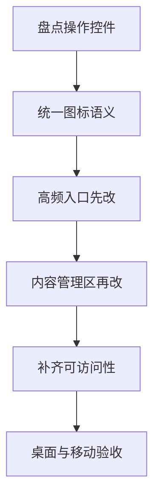

# Frontend Runtime Integration Handoff

## Goal

将当前 `SolidJS` 宿主前端从假数据 / 本地 store / 模拟流式状态，接入已经落地的 `Tauri 2 + Rust` 后端命令与事件，完成 Night Voyage 的前端联调基础版本。

本轮目标不是重做视觉设计，而是把现有界面接到真实后端：

- 聊天消息读取、发送、重新生成、轮次状态、流式事件
- 会话列表、单人 / 联机会话创建、成员管理
- 角色卡 CRUD
- 世界书与条目 CRUD
- API 档案 CRUD、模型列表拉取与选择

## 当前后端真实能力

### Chat Commands

- `messages_list`
- `send_message`
- `chat_submit_input`
- `regenerate_message`
- `chat_regenerate_round`
- `round_state_get`

### Conversation Commands

- `conversations_list`
- `conversations_create`
- `conversations_update_bindings`
- `conversations_rename`
- `conversations_delete`
- `conversation_members_list`
- `conversation_members_create`
- `conversation_members_update`
- `conversation_members_delete`

### Character Commands

- `character_cards_list`
- `character_cards_create`
- `character_cards_update`
- `character_cards_delete`

### World Book Commands

- `world_books_list`
- `world_books_create`
- `world_books_update`
- `world_books_delete`
- `world_book_entries_list`
- `world_book_entries_upsert`
- `world_book_entries_delete`

### Provider Commands

- `providers_list`
- `providers_create`
- `providers_update`
- `providers_delete`
- `providers_test`
- `providers_fetch_models`

### 2026-04-06 Claude Provider UI Integration Scope

本轮前端只补最小 Provider 设置页接入，不重做整体设置界面。

范围：

- 在 [`src/components/SettingsArea.tsx`](src/components/SettingsArea.tsx) 的 API 档案表单增加 `providerKind` 选择
- 允许创建与编辑：
  - `openai_compatible`
  - `anthropic`
- 表单保存时把 `providerKind` 透传给 [`src/lib/backend.ts`](src/lib/backend.ts) 和 [`src/App.tsx`](src/App.tsx)
- 保持现有 `SolidJS` 宿主结构不变，不引入新的前端状态管理框架

交互约束：

- 默认新建档案仍使用 `openai_compatible`
- 当用户切换到 `anthropic` 时，允许手动填写 Claude 原生 base URL；不在前端静默改写用户输入
- 模型拉取按钮继续沿用当前入口，但文案需从“OpenAI 兼容 API 档案”放宽为通用 provider 档案
- 若后端返回 `providerKind = anthropic`，列表中必须原样显示，不要映射成 OpenAI 文案
- 本轮不在前端暴露 tool use、thinking、图片输入等高级开关；这些能力仍由后端能力矩阵控制

### Preset Commands

- `presets_list`
- `presets_get`
- `presets_compile_preview`
- `presets_create`
- `presets_update`
- `presets_delete`

### Stream / State Events

- `llm-stream-chunk`
- `llm-stream-error`
- `chat-round-state`

## 必须替换掉的假数据 / 本地状态来源

### App Level

当前 [`src/App.tsx`](src/App.tsx) 中仍存在：
- 静态 `messages`
- `simulateStreamingResponse()`
- `setTimeout()` 模拟 AI 回复
- 本地 `handleSend()` / `handleRegenerate()` 假逻辑

这些都必须被真实后端调用替换。

### Session Sidebar

当前 [`src/components/SessionSidebar.tsx`](src/components/SessionSidebar.tsx) 中仍使用：
- `dummySessions`

应替换为 `conversations_list` 返回结果。

### New Chat Modal

当前 [`src/components/NewChatModal.tsx`](src/components/NewChatModal.tsx) 中仍使用：
- `dummyChars`
- `dummyKBs`
- `dummyPresets`
- `console.log("Create session with:")`

应替换为：
- `character_cards_list(cardType='npc')`
- `world_books_list`
- 预设本轮仍不做 CRUD，因此 UI 可保留占位但不可误导为已接后端
- `conversations_create`

2026-05-10 联机会话创建校验补充：
- `src/components/NewChatModal.tsx` 在创建联机房间前必须明确校验角色卡、会话模式和 API 档案。
- 缺少 API 档案时，房间配置区需直接提示“联机会话需要房主的 API 档案用于自动生成回复”，避免笼统显示“请先完善会话配置”。
- 该调整不改变 Tauri command payload；仍通过 `conversations_create` 创建会话，再通过 `room_create` 开启 TCP 房间。

### Settings Area

当前 [`src/components/SettingsArea.tsx`](src/components/SettingsArea.tsx) 中仍使用：
- `setTimeout()` 模拟模型拉取
- 组件内本地 signal 直接充当档案状态

应替换为：
- `providers_list`
- `providers_create`
- `providers_update`
- `providers_delete`
- `providers_test`
- `providers_test_claude_native`
- `providers_fetch_models`

Claude 专用测试入口补充：
- 在 [`src/components/SettingsArea.tsx`](src/components/SettingsArea.tsx) 为 `providerKind = anthropic` 显示独立“Claude 原生测试”按钮
- 最小参数表单参考 CC Switch：
  - `testModel`
  - `timeoutSeconds`
  - `testPrompt`
  - `degradedThresholdMs`
  - `maxRetries`
- 该按钮不依赖模型列表接口，允许用户在未拉取模型列表时直接输入测试模型并发起测试
- 前端必须展示：测试中状态、成功结果摘要、失败错误文本
- 本轮不实现完整 JSON 配置编辑器，不实现代理配置/计费配置等附加面板

### Character Sidebar

当前 [`src/components/CharacterSidebar.tsx`](src/components/CharacterSidebar.tsx) 仍依赖：
- [`src/store/characterStore.ts`](src/store/characterStore.ts)
- `localStorage`
- 默认假角色

应替换为后端角色卡命令。

### World Book UI

当前 [`src/components/WorldBookSidebar.tsx`](src/components/WorldBookSidebar.tsx) 与 [`src/components/WorldBookEntryArea.tsx`](src/components/WorldBookEntryArea.tsx) 仍依赖：
- [`src/store/worldBookStore.ts`](src/store/worldBookStore.ts)
- `localStorage`
- 默认假世界书

应替换为世界书命令。

世界书前端在接入真实后端后，还需要同步体现当前 V2 运行时语义：
- 关键词触发范围不再只看当前轮输入，还会参考最近历史和最新角色状态层
- `triggerMode = any | all` 需要用前端文案明确解释
- 同一条世界书条目即使被多个来源同时命中，也只会注入一次
- 条目 `sortOrder` 会影响同来源命中时的优先级，因此编辑器需要允许查看和调整
- 本轮不新增世界书命中调试命令，前端只负责把运行时规则说明清楚，不在宿主层复算匹配逻辑

## 前端状态流建议

## 1. App-Level Shared State

建议在 [`src/App.tsx`](src/App.tsx) 或新建前端 service / state 模块中维护：

- `activeWorkspace`
- `selectedConversationId`
- `selectedConversation`
- `conversationList`
- `conversationMembers`
- `messages`
- `currentRoundState`
- `providers`
- `charactersNpc`
- `charactersPlayer`
- `worldBooks`
- `activeWorldBookEntries`
- loading / error 状态

## 2. 消息模型映射

后端返回 `UiMessage`，前端现有 [`ChatMessage`](src/components/MessageItem.tsx:5) 需要适配。

建议映射：

```ts
type ChatMessage = {
  id: string;
  sender: 'user' | 'ai';
  senderName: string;
  content: string;
  avatar?: string;
  isStreaming?: boolean;
  roundId?: number;
  memberId?: number;
  isSwipe?: boolean;
  swipeIndex?: number;
  replyToId?: number;
  messageKind?: 'user_visible' | 'assistant_visible';
};
```

## 2026-05-10 Online Room Join Runtime Handoff

- `JoinRoomModal` now treats the top-right close action as panel dismissal only after a successful join. Leaving the room is an explicit `roomLeave` action.
- `room_join` now returns the joined remote conversation, active members, recent messages, round state, room id, and the joining member id.
- The Solid host keeps joined-room metadata in an in-memory `RoomClientSession` and inserts that remote conversation into the session list without writing remote room state to the local database.
- Room client sends use the member id returned by the host handshake. Player messages are rendered from `room:player_message`; skipped actions intentionally do not append visible messages.
- Rust remains responsible for network transport, member identity, message persistence, round state, and stream broadcast. Frontend code only renders the returned room snapshot and live events.

映射规则：
- `role === 'assistant'` -> `sender = 'ai'`
- `role === 'user'` -> `sender = 'user'`
- `displayName` 优先作为 `senderName`
- assistant 默认可显示为 `CHAT A.I+` 或当前角色名，后续可再细化

## 3. 流式事件处理

前端必须使用 `listen` 订阅：

- `llm-stream-event`
- `llm-stream-error`
- `chat-round-state`

兼容说明：
- `llm-stream-chunk` 可暂时保留给旧调用方，但新的宿主主链路应优先消费 `llm-stream-event`
- `llm-stream-event` 是统一流式事件出口，用于承载 OpenAI 与 Anthropic 的文本、thinking、未来 tool use / image 等事件

处理规则：
- `llm-stream-event`
  - `eventKind = text_delta`
    - 若消息不存在则补 assistant 占位
    - 若消息存在则拼接 `textDelta`
  - `eventKind = message_stop`
    - 关闭 `isStreaming`
  - `eventKind = thinking_delta`
    - 当前前端默认不展示
    - 但应允许调试日志或未来调试面板消费
  - `eventKind = content_block_start/content_block_stop/tool_use`
    - 本轮前端可先忽略显示，但不得报错
- `llm-stream-error`
  - 保留消息卡片
  - 标记错误状态
- `chat-round-state`
  - 更新当前轮等待人数 / 是否自动发送 / 当前轮状态

## 4. 桌面 / 移动端一致性

### Desktop

仍保留现有三列框架：
- WorkspaceSidebar
- SessionSidebar / SettingsSidebar / CharacterSidebar / WorldBookSidebar
- ChatArea + ChatInputBar + RightDrawer

### Mobile

[`src/components/MobileView.tsx`](src/components/MobileView.tsx) 需要接同一套后端状态，不允许继续使用独立假逻辑。

移动端要求：
- 会话列表与聊天页共享同一状态源
- 返回按钮切回 session list
- 发送、重新生成、流式更新与桌面一致

## 页面接入顺序

### 1. 聊天主链路

优先接：
- [`src/App.tsx`](src/App.tsx)
- [`src/components/ChatArea.tsx`](src/components/ChatArea.tsx)
- [`src/components/ChatInputBar.tsx`](src/components/ChatInputBar.tsx)
- [`src/components/MessageItem.tsx`](src/components/MessageItem.tsx)
- [`src/components/MobileView.tsx`](src/components/MobileView.tsx)

要求：
- 移除假流式
- 接入真实 `messages_list`
- 接入真实发送
- 接入真实重新生成
- 接入流式事件

### 2. 会话侧边栏与新建会话

接：
- [`src/components/SessionSidebar.tsx`](src/components/SessionSidebar.tsx)
- [`src/components/NewChatModal.tsx`](src/components/NewChatModal.tsx)

要求：
- 使用 `conversations_list`
- 使用 `conversations_create`
- 使用 `conversation_members_*`
- 联机会话显示等待状态 / 房间成员摘要

### 3. API 档案

接：
- [`src/components/SettingsArea.tsx`](src/components/SettingsArea.tsx)

要求：
- 用真实档案列表替换本地 signal 假数据
- `providers_fetch_models` 更新模型下拉框
- `providers_update` / `providers_create` / `providers_delete` 真实工作

### 4. 角色卡

接：
- [`src/components/CharacterSidebar.tsx`](src/components/CharacterSidebar.tsx)

要求：
- 弃用 [`src/store/characterStore.ts`](src/store/characterStore.ts)
- 按 tab 分别请求 `npc` / `player`
- 创建、编辑、删除走后端命令
- 角色卡 UI 必须接入结构化基础层字段 `baseSections`，不能继续只依赖 `description`
- 角色编辑器至少支持：
  - 新增 / 删除基础段落
  - 编辑 `sectionKey`
  - 编辑 `title`
  - 编辑 `content`
  - 编辑 `sortOrder`
- 角色详情或编辑视图中，需把 `baseSections` 作为“角色基础层”显式展示，避免和 `firstMessages` 混淆
- `description` 仍保留为兼容字段，但前端语义上应标记为“兼容描述 / 回退文本”，不能再作为唯一基础层来源
- 本轮新增的第 3 层角色状态覆盖层 UI 也要接入：
  - 监听 `character-state-overlay-updated`
  - 监听 `character-state-overlay-error`
  - 在聊天侧边信息区或抽屉区展示当前会话角色的最新状态覆盖层摘要
  - 区分 `CharacterBase` 与 `CharacterStateOverlay`，不能把两层混在同一文案块里
  - 错误状态必须可见，不允许静默吞掉
  
  ### 4.1 剧情总结层抽屉与聊天脚标
  
  接：
  - [`src/components/RightDrawer.tsx`](src/components/RightDrawer.tsx:31)
  - [`src/components/ChatArea.tsx`](src/components/ChatArea.tsx:10)
  - [`src/components/MessageItem.tsx`](src/components/MessageItem.tsx:1)
  - 共享聊天状态层，例如 [`src/App.tsx`](src/App.tsx:1)
  
  要求：
  - 聊天历史继续完整展示，不因剧情总结而从聊天区移除旧消息
  - 已被剧情总结覆盖的轮次在聊天区显示脚标，例如 `摘 1`、`摘 2`
  - 聊天脚标只反映“该轮已被压缩进哪条剧情总结”，不改变消息本身可见性
  - 右侧抽屉扩展为剧情总结时间线入口，按时间顺序展示全部剧情总结条目
  - 抽屉中每条剧情总结至少展示：
    - 覆盖轮次范围
    - 来源 `ai | manual | manual_override`
    - 状态 `queued | completed | failed | pending`
    - 正文文本
  - 手动模式下，若存在待总结窗口，抽屉必须显示显式提醒卡片
  - 待总结窗口允许累积；前端需显示待总结数量与各窗口轮次范围
  - 在 AI 模式下，用户仍可编辑已有 AI 剧情总结，并将其覆盖为手动版本
  - 剧情总结正文保持纯文本换行展示，不做 JSON 表单编辑器
  - 前端要明确提示：已总结轮次虽然仍显示在聊天区，但默认不再进入请求体原文历史
  - 若某窗口尚未完成手动总结，则该窗口继续作为原文参与请求体；这一状态必须在抽屉中可见
  - 建议支持从聊天脚标定位到抽屉中的对应剧情总结条目
  - 需要监听新增事件：
    - `plot-summary-updated`
    - `plot-summary-error`
    - `plot-summary-pending`

### 5. 世界书

接：
- [`src/components/WorldBookSidebar.tsx`](src/components/WorldBookSidebar.tsx)
- [`src/components/WorldBookEntryArea.tsx`](src/components/WorldBookEntryArea.tsx)

要求：
- 弃用 [`src/store/worldBookStore.ts`](src/store/worldBookStore.ts)
- 世界书列表与条目编辑都走后端命令
- 触发方式 UI 至少支持 `any` / `all`
- 在条目编辑区展示 V2 触发说明：当前轮输入、最近历史、角色状态都会参与匹配
- 在条目编辑区暴露 `sortOrder`，让用户能调节同来源命中时的注入优先级
- 明确提示“多来源命中只注入一次”，避免用户误解为会重复叠加同条设定

## UI / 交互要求

- 所有 `invoke` 都必须有 loading / error 状态
- 不允许静默失败
- 若后端返回错误，要在 UI 上可见
- 流式消息必须即时更新，不得等待整段结束再一次性替换
- 会话切换时要先清空旧流，再加载新消息
- 重新生成时保留旧内容，不要直接覆盖旧消息卡片

## 未完成与保留边界

- 预设前端本轮继续补齐 workspace 内的剩余功能，目标覆盖：真实预设创建、删除、基础参数编辑、stop sequences 基础编辑、provider overrides 基础编辑、编译预览查看
- 预设前端交互方向调整：**取消语义组选项树宿主 UI**，宿主层只保留三类治理交互：锁定条目、互斥选择组、普通开关条目
- 预设前端展示顺序要求：
  - 锁定条目放在最上面，作为不可随意改动的安全区
  - 互斥选择组放在中间，作为“多选一 / 单选组”的主要交互区域
  - 普通开关条目放在最后，作为自由启停的补充条目
- 预设前端对 `PresetDetail.semanticGroups` 的处理要求：
  - 不再以树形缩进方式直接展示 `semanticGroups`
  - `selectionMode = single` 的语义组应在宿主层平铺收敛为“互斥选择组”交互
  - `selectionMode = multiple` 的语义组选项应在宿主层收敛为普通开关条目交互
  - 宿主层允许为条目提供独立“编辑”入口，但编辑入口不得与切换交互冲突
  - 前端提交的仍然是结构化结果，不在宿主侧自行参与运行时编译
  - 保存普通条目或互斥自由条目时，只能提交 `semanticOptionId` 为空的 direct blocks；不得把 `PresetDetail.blocks` 中的语义物化块回写为 direct blocks，否则会导致条目重复与分组污染
- 预设前端本轮仍不覆盖新建会话中的 preset 绑定交互
- 预设前端本轮仍不做：preset examples 的完整编辑器、provider override 的高级校验面板、编译调试时间线、导入导出
- 角色状态覆盖层前端本轮只做“查看最新状态 + 接收成功/失败事件”
- 角色状态覆盖层前端本轮不做：手动编辑、历史版本时间线、手动重试按钮
- 剧情总结层前端本轮应接入：时间线抽屉、聊天脚标、待总结提醒、手动总结编辑、AI 条目覆盖编辑
- 剧情总结层前端本轮不做：总结版本审计时间线、子条目级结构化编辑器、自动二次归档摘要
- 真实联网同步本轮不做
- Agent 模式开关本轮不要求进入前端完整 UI，但要避免把数据结构写死成单模型专用

## 本次启动性能修复记录（2026-04-04）

### 现象

- `tauri dev` 日志中的 [`vite`](vite.config.ts) 很快显示 ready，但桌面端主窗口长时间不出现。
- 浏览器直接访问开发地址时，首屏会长时间停留在 [`index.html`](index.html) 的静态启动遮罩。

### 已确认根因

1. [`src/index.tsx`](src/index.tsx) 会先导入 [`src/index.css`](src/index.css)，而 Tailwind 首次处理 CSS 时会受到工作区扫描范围影响。
2. 仓库根 [`.gitignore`](.gitignore) 之前没有忽略 [`src-tauri/target/`](src-tauri/target) 与 [`.cache/`](.cache)，导致前端开发期的样式扫描/文件遍历成本被异常放大。
3. [`src-tauri/tauri.conf.json`](src-tauri/tauri.conf.json) 原先把窗口配置为 `visible: false`，使前端启动抖动被放大成“应用没有启动”。

### 本次修复

- 在 [`.gitignore`](.gitignore) 中补充忽略 [`.cache/`](.cache) 与 [`src-tauri/target/`](src-tauri/target)。
- 在 [`vite.config.ts`](vite.config.ts) 中补充对 [`.cache/`](.cache) 的 watch ignore，避免开发期额外扫描噪音。
- 在 [`src-tauri/tauri.conf.json`](src-tauri/tauri.conf.json) 中将主窗口改为初始可见，避免窗口显示时机绑定到前端初始化完成之后。
- 移除仅用于定位启动问题的临时打点日志，保持运行时代码干净。

### 修复后观测

- 修复前：单独请求 [`src/index.css`](src/index.css) 首次耗时约 78s~96s。
- 修复后：单独请求 [`src/index.css`](src/index.css) 首次耗时约 713ms。
- 修复后：开发首页请求约 101ms；[`src/index.tsx`](src/index.tsx) 约 188ms；[`src/App.tsx`](src/App.tsx) 约 4035ms，已不再是“近一分钟假死”级别。

## 风险提示

### 风险 1
- 风险点：若前端继续保留本地 store 与后端状态并存，会导致数据源分叉。
- 影响范围：角色卡、世界书、消息列表、会话列表一致性。
- 建议的修正方向：优先统一到后端为唯一事实源。

### 风险 2
- 风险点：若先做局部接入，不统一抽聊天状态层，桌面与移动端容易出现两套逻辑。
- 影响范围：消息刷新、流式渲染、会话切换、重新生成。
- 建议的修正方向：在 [`src/App.tsx`](src/App.tsx) 或共享 service 中建立统一状态源，再分别喂给桌面与移动端组件。

## 本轮成功标准

1. 能创建单人 / 联机会话
2. 能进入会话并加载消息
3. 能发送消息并看到真实流式回复
4. 能重新生成并保留旧版本
5. 能管理角色卡
6. 角色卡 UI 能编辑并展示 `baseSections`
7. 聊天侧 UI 能显示当前会话角色的最新 `CharacterStateOverlay`
8. 状态覆盖层成功 / 失败事件在 UI 上可见
9. 能管理世界书与条目
10. 能管理 API 档案并拉取模型列表
11. workspace 里的预设治理 UI 能读取真实 preset / block 数据
12. 能创建和删除 preset
13. 能编辑 preset 基础参数、stop sequences 和 provider overrides 的基础字段
14. 能查看 preset 编译预览结果
15. 预设 block 的锁定态与互斥组信息能在 UI 中可见并限制交互
16. 预设语义组选项树能读取真实 `semanticGroups` 数据并以缩进层级正确展示
17. `selectionMode = single` 的语义组在 UI 中直接表现为单选并正确保存
18. 语义子项的启用态、选中态与说明文本在 UI 中可见
19. 桌面与移动端都连接到同一套真实后端状态
20. 聊天区能为已总结轮次显示剧情总结脚标
21. 右侧抽屉能按时间顺序展示全部剧情总结条目
22. 手动模式下能显示累积的待总结窗口，并允许补写任意窗口总结
23. 已总结轮次在 UI 中仍可见，但不再作为原文进入请求体
24. AI 模式下生成的剧情总结可被用户编辑覆盖

## 前端图标 UI 改造补充方案（2026-04-04）

### 任务分类与白名单

- 当前任务分类：前端
- 白名单判定：允许继续，由前端白名单代理执行
- 后端影响：无，本轮不触碰 `src-tauri/**`
- 性能原则：仅复用现有 `lucide-solid` 图标与宿主样式体系，不新增重型图标框架，不引入额外主线程动画负担

### 用户确认的目标边界

本轮采用 **方案 A**：

- 仅将操作控件图标化，重点覆盖文字按钮、切换按钮、工具栏按钮
- 保留标题、表单标签、正文说明、错误文案、空状态文案
- 不追求整站去文字，避免因为激进去标签而损伤可读性与学习成本

### 影响范围

本轮优先处理以下前端组件中的可操作控件：

- `src/components/SessionSidebar.tsx`
- `src/components/ChatInputBar.tsx`
- `src/components/NewChatModal.tsx`
- `src/components/SettingsArea.tsx`
- `src/components/CharacterSidebar.tsx`
- `src/components/WorldBookSidebar.tsx`
- `src/components/WorldBookEntryArea.tsx`
- `src/components/RightDrawer.tsx`
- `src/components/MessageItem.tsx`
- `src/components/MobileView.tsx`
- `src/components/CompletionSidebar.tsx`
- `src/components/CompletionPreviewModal.tsx`
- `src/components/CompletionDetailModal.tsx`
- `src/components/CompletionParametersPanel.tsx`
- `src/components/CompletionPresetArea.tsx`
- `src/components/TitleBar.tsx`
- `src/App.tsx`

### 操作控件图标化规则

#### 1. 图标来源

- 优先复用现有 `lucide-solid`
- 先不引入第二套图标库
- 相同语义动作在不同页面必须复用同一图标，避免一处一个意思

#### 2. 语义映射

- 新建：`Plus`
- 加入或邀请：`UserPlus`
- 保存：`Save` 或 `Check`
- 取消或关闭：`X`
- 返回：`ArrowLeft`
- 编辑：`Pencil`
- 删除：`Trash2`
- 上传：`Upload`
- 刷新：`RefreshCw`
- 发送：`SendHorizontal`
- 模式切换：使用成对语义图标，不再直接显示按钮文字
- 查看详情或抽屉展开：`PanelRightOpen`、`PanelRightClose`、`Info`

#### 3. 状态表达

- 主动作：保留高强调底色与阴影，通过图标替代原按钮文字
- 次动作：使用低强调边框或浅底图标按钮
- 危险动作：统一红色危险语义，不可与普通动作共享颜色
- 选中态：通过描边、背景高亮、图标颜色变化表达
- 禁用态：降低透明度，但仍保留图标可辨识度
- Loading 态：使用旋转图标或独立加载图标，不得静默无反馈

#### 4. 可访问性与触控热区

- 所有 icon-only 按钮必须补齐 `title` 与 `aria-label`
- 键盘焦点态必须可见，不能只靠 hover
- 桌面端最小命中区域不低于 `40 x 40`
- 触控端最小命中区域不低于 `44 x 44`
- 同一容器内连续图标按钮之间保留明确间距，降低误触

#### 5. 明确保留文字的区域

以下内容本轮明确不图标化：

- 页面标题与分区标题
- 表单标签与字段说明
- 消息正文、设定正文、错误提示、空状态文案
- 列表项标题、角色名、会话名、世界书名称
- 需要用户阅读理解的描述性说明文本

### 推荐实施顺序

1. 先抽离统一图标按钮样式规范，避免每个组件各写一套
2. 优先改造高频交互入口：会话侧边栏、聊天输入栏、新建会话、设置区
3. 再改造内容管理区：角色卡、世界书、世界书条目、预设面板与弹窗
4. 最后复查移动端、抽屉、标题栏、消息操作与边缘入口
5. 全量补齐 `title`、`aria-label`、焦点态与移动端点击热区

### 验收口径

- 主要可操作文字按钮已替换为图标按钮或图标切换控件
- 标题、标签、正文说明依然保留文字上下文
- 每个 icon-only 控件都有明确的 `title` 与 `aria-label`
- PC 与 Android 端均不存在图标过密、误触、语义不清的问题
- 未新增与图标化无关的后端改动
- 未引入额外重型依赖或阻塞式前端逻辑

### 实施流程图


