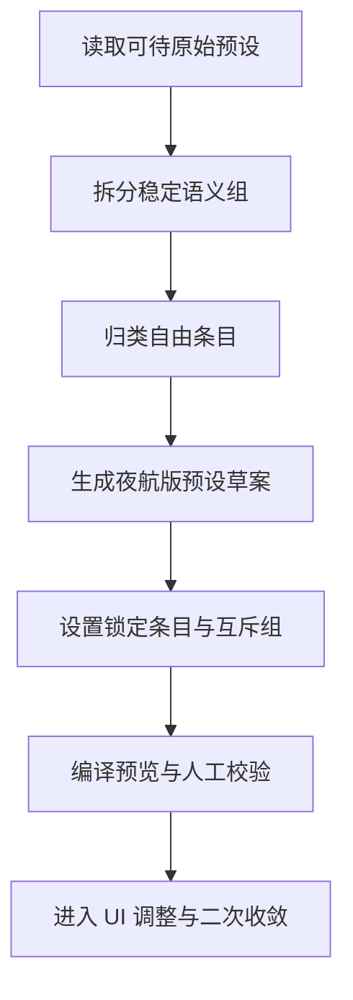

# Night Voyage 版可待预设迁移计划

## 目标

把 [`3.27【可待】甲戌.json`](3.27【可待】甲戌.json) 迁移为符合 Night Voyage 架构的预设草案，保证：

- 不复刻 ST 式前后夹文本块工作流
- 不破坏现有 Prompt Compiler 的运行时真相模型
- 优先利用 Night Voyage 已有的语义组、互斥组、条目锁与结构化 block
- 迁移结果可继续在 UI 中树形编辑、在后端保存期展开、在运行时稳定编译

---

## 已冻结前提

迁移开始前，以下前提视为固定：

1. 运行时真相 = 物化后的 `blocks / examples / params`
2. 编辑时真相 = 语义树 `semanticGroups`
3. 语义树只负责编辑，不直接进入运行时热路径
4. 保存期后端负责展开与物化
5. `安全区 / 自由区` 只做展示层分区，不新增运行时语义

相关文档：

- [`plans/kedai-preset-migration-prep.md`](plans/kedai-preset-migration-prep.md)
- [`plans/preset-usability-improvements.md`](plans/preset-usability-improvements.md)
- [`docs/preset-system-architecture.md`](docs/preset-system-architecture.md)
- [`docs/prompt-compiler-and-injection-summary.md`](docs/prompt-compiler-and-injection-summary.md)

---

## 总体迁移思路

一句话说：

**先拆语义，再落结构，再跑预览。**

---

## 第一阶段：把可待拆成 Night Voyage 能理解的几类东西

### A. 一级语义组

先把最稳定、最强互斥、最像“导演要求总开关”的部分提出来。

建议优先固定：

- `conversation-mode`
  - `single`
  - `group`
- `content-rating`
  - `sfw`
  - `nsfw`

### B. 二级语义组

再把高频、通用、强语义、强互斥的部分收进语义组：

- `narrative-perspective`
- `reply-length`
- `retelling-policy`
- `story-pace`
- `thought-mode`
- `dialogue-density`
- `initiative-policy`
- `style-family`

### C. 自由 block

把以下类型归入自由 block：

- 个性化风格补丁
- 实验性剧情规则
- 特殊禁词库
- 少量高个性作者说明
- 不适合进入固定语义组的特殊约束

### D. few-shot 示例

把原预设里真正承担“示例对话教学”职责的内容抽出，归到：

- `preset_examples`

而不是继续揉进规则块文本。

### E. 参数层

把采样参数单独归到：

- `temperature`
- `max_output_tokens`
- `top_p`
- 其他已支持参数

不再把参数解释文本混在普通规则块里。

---

## 第二阶段：形成 Night Voyage 版可待预设草案

这一步的目标不是 1:1 复刻 ST 文本，而是得到“语义上等价、结构上适配”的草案。

### 草案应至少包含

1. 预设摘要
   - 名称
   - 一句话效果总结
   - 适用场景
   - 内容分级

2. 语义组选项树
   - 一级组
   - 二级组
   - 子项说明
   - 示例
   - 适用场景标签

3. 物化 blocks
   - 规则块
   - 自由补丁块
   - 锁定块
   - 互斥块

4. few-shot 示例
5. 采样参数

---

## 第三阶段：设置安全区与自由区

### 安全区

建议优先纳入：

- 主提示词骨架
- 一级语义组对应条目
- 高频基础规则
- 必须互斥的核心条目
- 必须锁定的条目

### 自由区

建议纳入：

- 作者自由补丁
- 实验性风格块
- 临时增强说明
- 不影响主骨架稳定性的自定义规则

说明：

- 这是展示与编辑分区
- 不是运行时分区

---

## 第四阶段：设置锁定与互斥

### 必须锁定的内容

至少建议锁定：

- 主骨架块
- 一级分组骨架块
- 会直接破坏结构或编译稳定性的核心块

### 必须互斥的内容

至少建议做互斥组：

- 单人 / 多人
- SFW / NSFW
- 第一人称 / 第二人称 / 限知第三人称 / 全知第三人称
- 短回复 / 中回复 / 长回复
- 转述策略组
- 剧情推进组
- 思考方式组

---

## 第五阶段：编译校验

迁移完成后，必须通过下列校验：

1. 结构校验
   - 语义组机器键稳定
   - 单选组只启用一个
   - 锁定条目未被破坏

2. 编译校验
   - [`presets_compile_preview`](src-tauri/src/commands/presets.rs:244) 能输出可读结果
   - 规则块顺序符合 Night Voyage 固定层级
   - few-shot 未混进 `system`

3. 体验校验
   - 一眼看得出这套预设适合什么场景
   - 一眼看得出哪些是安全区、哪些是自由区
   - 一眼看得出哪些是单选项

---

## 迁移时不做的事

- 不复刻 ST 宏语言
- 不复刻 ST 前后夹文本块策略
- 不把可待整包拼成一个大 `system prompt`
- 不为了兼容可待而破坏 Night Voyage 的分层注入顺序
- 不把安全区 / 自由区变成运行时字段

---

## 迁移输出物

本轮迁移准备结束后，应至少产出：

1. 一份“可待条目 -> 语义组 / 自由 block / example / params”映射表
2. 一份 Night Voyage 版可待预设草案
3. 一份需要锁定条目与互斥组的清单
4. 一份编译预览检查结果

---

## 下一步实施顺序

1. 先做“可待条目分类表”
2. 再做 Night Voyage 版可待语义组树草案
3. 再做自由 block 草案
4. 再设锁与互斥
5. 最后跑编译预览，继续人工调校

---

## 最终一句话总结

Night Voyage 版可待预设迁移，不是“把可待整包搬过来”，而是：

**把可待拆成 Night Voyage 能稳定理解的语义组、自由 block、示例与参数，再重组成一套结构化预设。**
