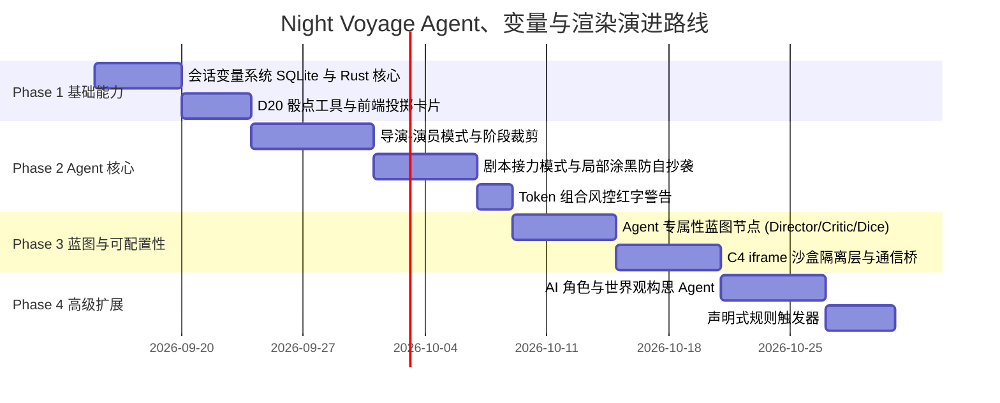

# Night Voyage Agent 体系、响应式变量系统与沙盒渲染层实施方案

> **文档定位**: Night Voyage 核心能力演进总规划（Agent 体系、变量系统、双层渲染架构）  
> **创建时间**: 2026-09-12  
> **关联约束**: [`AGENTS.md`](file:///d:/data/Night%20Voyage/AGENTS.md) (C1 前端纯渲染, C2 零静默回退, C3 响应性保护, C4 AI UI 隔离, C5 双端独立, C7 双端覆盖)  
> **关联代码模块**:
> - 后端核心: `src-tauri/src/services/` (`prompt_compiler.rs`, `memory_service.rs`, `chat_service.rs`, `blueprint_executor.rs`), `src-tauri/src/models/`
> - PC 前端: `src/components/` (`MessageFormatRenderer.tsx`, `NativeThinkingBlock.tsx`, `ChatArea.tsx`, `blueprint/`)
> - 移动前端: `src-mobile/`

---

## 1. 架构总览与核心设计原则

Night Voyage 作为基于 `Tauri 2.0 + Rust` 核心与 `SolidJS` 前端宿主的桌面/移动端原生跑团与角色扮演应用，其系统演进坚决贯彻以下设计原则：

```
                    ┌────────────────────────────────────────┐
                    │       Night Voyage 全景架构体系         │
                    └───────────────────▲────────────────────┘
                                        │
          ┌─────────────────────────────┼─────────────────────────────┐
          │                             │                             │
┌─────────┴─────────┐         ┌─────────┴─────────┐         ┌─────────┴─────────┐
│ 1. 模块化 Agent   │         │ 2. 响应式变量系统 │         │ 3. 双层渲染层     │
│  - 经典/导演/剧本 │         │  - 强类型会话变量 │         │  - 静态结构化卡片 │
│  - 阶段裁剪/防自抄│         │  - 毫秒级状态同步 │         │  - C4 iframe 动态 │
│  - 纯内存流转状态 │         │  - 蓝图与工具打通 │         │    AI UI 物理隔离 │
│  - Token 红字风控 │         │  - 替代原版ST脚本 │         │  - 最小通信桥     │
└───────────────────┘         └───────────────────┘         └───────────────────┘
```

### 核心硬约束对齐（Guardrails C1–C7）
1. **C1 前端纯渲染（Frontend Render-Only）**：Agent 状态机调度、多代理分发、D20 骰点算法、变量存取与计算全部封装于 Rust 后端。前端仅负责接收状态、绘制 UI 与发送用户动作。
2. **C2 零静默回退（Zero-Fallback Errors）**：工具调用失败、检定异常、子任务中断均显式向上冒泡，UI 呈现明确错误态，严禁“假成功”或悄悄降级。
3. **C3 响应性保护（Responsiveness Protection）**：所有多代理流转、AI 规划与变量持久化均为异步管道，UI 线程 0 假死，保证流式打字机流畅输出。
4. **C4 AI UI 隔离（AI UI Isolation）**：AI 动态生成的界面组件绝对限制在独立的 `iframe` / `Shadow DOM` 沙盒中，允许使用 `HTML + Tailwind`，但严禁污染宿主样式、状态与事件。
5. **C5/C7 双端独立与全覆盖**：后端暴露统一的 Tauri Command / Event 接口，PC 端（`src/`）与移动端（`src-mobile/`）各自实现适配各自屏幕形态的渲染，两端零 UI 代码耦合。

---

## 2. 模块化 Agent 体系设计

### 2.1 三态对话模式划分（Classic 与 Agent 严格解耦）

系统支持三种互斥可配的会话推进模式：

| 模式 | 运行机制 | 额外开销 | 适用场景 |
| :--- | :--- | :--- | :--- |
| **0. Classic (传统模式)** | 单次 Prompt 编译直通 LLM，可选挂载 MEM0 或传统上下文。 | **0 额外 Token**<br>**0 额外延迟** | 日常轻度对话、低成本文学阅读、快速沉浸体验。 |
| **1. Director-Actor (导演-演员模式)** | **总导演 Agent** 总揽全景，通过工具派发精简任务给 **NPC 演员 Subagent**，演员以角色视角演出并交回台词。 | 额外 1~2 次调用<br>(中等开销) | 复杂 TRPG 跑团、多 NPC 同屏互动、派系博弈。 |
| **2. Scriptwriter (剧本模式)** | **初稿写手 (Drafter)** $\rightarrow$ **审阅批注 (Critic)** $\rightarrow$ **终稿润色 (Refiner)** 接力打磨。 | 额外 2~3 次调用<br>(重度开销) | 高质量小说文学创作、戏剧化长文生成。 |

---

### 2.2 模式一：Director-Actor（导演-演员模式 / Return-mode Subagent）

#### 工作逻辑与心智隔离
传统跑团最大的代入感杀手是“NPC 拥有上帝全知视角”。导演模式通过**信息分级**彻底杜绝全知污染：

```
[玩家输入: "我想打听盗贼公会的密道在哪"]
                   │
                   ▼
┌────────────────────────────────────────────────────────┐
│ 1. 导演 Agent (Director / DM 主持人)                   │
│  - 全局视野: 拥有完整大纲、全局 MEM0 设定、全量世界书   │
│  - 判定: 识别需要进行社交检定 (威吓/交涉)             │
│  - 调度: 自动发起 dice_roll 工具调用                   │
│  - 阶段裁剪: 浩瀚世界书中仅提取【酒馆老板个人秘密】条目 │
│  - 编写导演小纸条: "【指令】你惧怕盗贼公会，撒谎敷衍； │
│                    不要说出钥匙在酒桶底下的秘密"       │
└──────────────────────────┬─────────────────────────────┘
                           │ agent.delegate 派发任务 (Scoped Task)
                           ▼
┌────────────────────────────────────────────────────────┐
│ 2. 演员 Subagent (Actor / 酒馆老板)                    │
│  - 局部视野: 仅注入酒馆老板角色卡 + 导演小纸条 + 玩家发言│
│  - 权限受限: 剥夺主聊天提交权限，仅能以人设进行口吻演绎│
│  - 交付: 通过 task.return 返回纯台词与微表情动作       │
└──────────────────────────┬─────────────────────────────┘
                           │
                           ▼
┌────────────────────────────────────────────────────────┐
│ 3. 导演收拢并定稿 (Finalize)                            │
│  - 导演合并骰点结果、环境描写与老板台词，统一提交渲染  │
└────────────────────────────────────────────────────────┘
```

---

### 2.3 模式二：Scriptwriter（剧本模式 / Handoff 接力流水线）

#### 工作逻辑
基于阶段式接力（Handoff），在同一个会话生命周期内串行推进，受 `max_handoff_depth = 4` 深度硬门禁约束：
1. **Drafter (初稿写手)**：根据玩家行动与当前场景快速输出 1.0 叙事草稿。
2. **Critic (审阅批注者)**：对照角色人设设定、世界观冲突点与文风节奏，输出结构化修改批注（如“情绪转变过快”、“道具名称与前文不一致”）。
3. **Refiner (润色终修者)**：结合批注对草稿进行精细润色，完成终稿并正式落地呈递玩家。

---

### 2.4 阶段性 Prompt 裁剪机制（Stage-Specific Pruning）

**大模型（尤其是小模型）输出劣化的核心根源在于上下文无关噪音污染**。Night Voyage 实施三重强隔离裁剪：

1. **工具集掩码（Tool Masking）**：
   - 导演阶段：开放 `dice_roll`、`agent_delegate`、`query_memory`；禁止文本润色工具。
   - 演员阶段：**硬性剥夺全局工具**，仅允许基础投骰与 `task_return`。
   - 审阅阶段：仅暴露 `submit_feedback` 批注工具。
2. **世界书与设定最小化（Lorebook Scoping）**：
   - 严禁将全量 50+ 世界书条目一股脑灌入演员上下文。
   - 由导演阶段动态选取出关联度最高的 1~3 条目注入演员，使上下文体积缩减 80%~90%，杜绝小模型注意力涣散。
3. **历史窗口微型切片（Context Slice）**：
   - 演员演绎仅需感知最近 2~4 轮即时对话，不传入 100 楼长历史，避免长文本注意力漂移。

---

### 2.5 Layer 1 Redaction（局部涂黑防自抄袭机制）

在剧本模式多轮精修或正文续写中，小模型极易将上一段原文开头复读（ABA 抄袭）。Night Voyage 实施内存级局部涂黑拦截：

```
历史消息中的前序段落 (300字):
"暴雨倾盆而下，酒馆的木门被狂风狠狠撞开。神秘人缓步走入，水渍在他脚边蔓延。
 他摘下兜帽，露出一双鹰隼般的黄金眼瞳，死死盯住了吧台角落里的老矮人。"
                             │
                             ▼ [发送前拦截: 掏空腹部, 保留尾部续接锚点]
"[此文本已被运行时遮蔽（原文 300 字，玩家已可见）。末尾续接锚点(35字)：
 '...露出一双鹰隼般的黄金眼瞳，死死盯住了吧台角落里的老矮人。']
 请从锚点自然续写后续事件，绝对不要重述、不要把前文换个说法再说一遍！"
                             │
                             ▼ [模型生成完毕后]
                 立即在内存中执行 restore()，完全复原原文
```
- **阈值控制**：仅对超过 80 字的历史叙事块生效。
- **锚点保留**：保留末尾 30~50 字作为语气和情境过渡，模型物理层面无法看到前序全文，彻底消除自抄袭。

---

### 2.6 D20 骰点工具调用设计（Dice Tool Call）

- 摒弃让模型自行胡诌骰点结果的伪跑团做法。
- 模型在感知到行动对抗或检定需求时，主动触发工具调用：
  `tool_call: dice_roll({ formula: "1d20+3", reason: "敏捷(翻滚)检定", dc: 14 })`
- **Rust 后端执行**：
  1. 使用安全真随机数发生器投出点数；
  2. 计算检定成功/失败（如 17 >= 14，`Success`）；
  3. 即时通过 Tauri Event 向前端广播 `{ event: "dice:rolled", roll: 17, dc: 14, passed: true }`，前端渲染动效投骰卡；
  4. 将检定结果文本回填给模型继续推导文学正文。

---

### 2.7 坚决摒弃沙盒文件系统（采用 Rust 内存结构体流转）

- **技术裁决**：TauriTavern 的 `WorkspaceSandbox` 引入了庞大的虚拟磁盘文件读写、SHA256 哈希计算和 Checkpoint 快照，本质上是“为一点肉馅包了一整盘饺子”，带来大量的无谓 I/O 损耗。
- **Night Voyage 轻量化方案**：
  - 所有的草稿、审阅批注与中间产物全部以 **Rust 强类型结构体在内存中传递**：
    ```rust
    pub struct TurnPipelineStage {
        pub draft_text: String,
        pub critic_feedback: Option<String>,
        pub revised_text: Option<String>,
        pub active_dice_result: Option<DiceRollResult>,
    }
    ```
  - 纯内存流转，0 磁盘 I/O 开销，微秒级流转；定稿后单次事务写入 SQLite 历史表。

---

### 2.8 Token 组合风控红字警示机制

- **触发规则**：
  当用户在设置或会话中，使得以下三项高消耗模块的激活数量 $\ge 2$ 时：
  1. 纯导演模式 (`chat_mode == "director_actor"`)
  2. 纯剧本模式 (`chat_mode == "scriptwriter"`)
  3. MEM0 全权记忆检索 (`memory_mode == "mem0"`)
- **UI 呈现**：
  输入框上方与会话设置面板中强制弹出醒目红色危险提示框：
  > ⚠️ **这会导致消耗的TOKEN激增，尤其是对于按次计费的API来说，而这仅仅只是为了一次回答，请仔细斟酌这是否值得！**

---

## 3. 会话响应式变量系统（State & Variable Engine）

针对跑团与长篇角色扮演中数值脱节的痛点，Night Voyage 建立一套原生的强类型变量引擎，彻底取代 SillyTavern 社区碎片化、易出错的文本宏脚本。

### 3.1 数据架构与存储设计

在 SQLite 中引入会话专属变量表：

```sql
CREATE TABLE IF NOT EXISTS session_variables (
    session_id TEXT NOT NULL,
    var_name TEXT NOT NULL,
    var_type TEXT NOT NULL, -- 'number', 'string', 'boolean'
    num_val REAL,
    str_val TEXT,
    bool_val INTEGER,
    display_label TEXT,     -- 前端状态栏展示名 (如 "生命值")
    is_stat_bar INTEGER DEFAULT 1, -- 是否在顶部状态栏常驻
    updated_at INTEGER NOT NULL,
    PRIMARY KEY (session_id, var_name)
);
```

### 3.2 变量更新与事件驱动流程

```
┌────────────────────────────────────────────────────────┐
│ 1. Agent 决定变更数值 (Tool Call)                       │
│    update_variables({ hp: -15, gold: +50, loc: "酒馆" }) │
└──────────────────────────┬─────────────────────────────┘
                           │
                           ▼
┌────────────────────────────────────────────────────────┐
│ 2. Rust 后端事务写入 SQLite 变量表                      │
│  - 校验合法性 (防溢出、防注入)                         │
└──────────────────────────┬─────────────────────────────┘
                           │
                           ▼
┌────────────────────────────────────────────────────────┐
│ 3. 触发 Tauri IPC 广播事件                              │
│    emit("session:variables_updated", payload)          │
└──────────────────────────┬─────────────────────────────┘
                           │
                           ▼
┌────────────────────────────────────────────────────────┐
│ 4. SolidJS 细粒度响应式更新                            │
│  - 顶部 StatusBar 状态栏数字无缝动态跳动刷新           │
│  - 0 页面重绘，0 虚拟 DOM 损耗                         │
└────────────────────────────────────────────────────────┘
```

### 3.3 变量系统在蓝图与 Prompt 中的无缝注入
- **蓝图节点（VariableNode）**：允许在 DAG 流水线中将变量值作为动态上下文抽取出来，连线注入 System Prompt。
- **模板宏支持**：在人设与问候语中支持原生语法 `{{var:HP}}`、`{{var:Gold}}`，在编译阶段由 Rust 后端统一安全替换。

---

## 4. 双层渲染系统（Rendering Layer）

### 4.1 静态结构化渲染层
- **Markdown & 文本格式化**：通过 `MessageFormatRenderer.tsx` 支撑粗体、斜体、引用段、代码高亮。
- **思维链折叠（NativeThinkingBlock）**：支持原生推理流折叠展示，并提供用时与 Token 统计。
- **结构化业务卡片**：
  - **D20 掷骰卡**：展示检定类型、DC 难度阈值、投掷结果徽章（大成功/成功/失败/大失败）。
  - **状态变更卡**：以平滑动画展示好感度增加、金币扣除、获得道具。

### 4.2 动态 AI UI 隔离渲染层（严格遵循 C4 约束）

当 AI 动态输出高自由度交互式界面（如：战力盘、怪物属性图鉴、装备强化栏、交互式六角格地图）时：

```
┌──────────────────────────────────────────────────────────────────────────┐
│ SolidJS 宿主页面 (受保护安全域)                                          │
│                                                                          │
│   ┌────────────────────────────────────────────────────────────────────┐ │
│   │ 物理隔离沙盒: <iframe sandbox="allow-scripts" srcdoc="...">       │ │
│   │  - 隔离内部: 运行 HTML + Tailwind CSS                               │ │
│   │  - 样式作用域: 绝对封禁在 iframe 内，0 污染宿主全局样式            │ │
│   │  - 交互桥梁: 仅通过 window.postMessage 发送结构化事件             │ │
│   │                                                                    │ │
│   │  ┌──────────────────────────────────────────────────────────────┐  │ │
│   │  │ AI 动态生成的战力装备栏 (HTML + Tailwind)                    │  │ │
│   │  │ [佩戴龙鳞甲]  [饮用治疗药水]                                   │  │ │
│   │  └──────────────────────────────┬───────────────────────────────┘  │ │
│   └─────────────────────────────────┼──────────────────────────────────┘ │
│                                     │ postMessage({ action: "use_item", id: 4 })
│                                     ▼                                    │
│   宿主接收并校验 -> 转发 Rust 后端执行逻辑 (C1 约束)                      │
└──────────────────────────────────────────────────────────────────────────┘
```

#### 隔离安全红线：
1. **禁用外部网络**：`iframe` 的 sandbox 属性严格限制，禁止任意外部资源直连；
2. **严禁宿主状态穿透**：AI 代码无法访问 `window.__TAURI__`，无法访问宿主 SolidJS store，一切操作只能通过结构化消息向宿主提出请求。

---

## 5. 可配置性边界：底层硬编码 vs 蓝图定义（Hardcoded vs Blueprint-Defined）

为了防止系统陷入“要么过度死板无法定制，要么蓝图过于复杂容易连线崩溃”的极端，系统确立核心原则：
> **“机制与安全由引擎硬编码保障，内容、分支与规则由蓝图自由编排”**
> （Engine owns mechanics & safety, Blueprint owns content & rules.）

```
┌────────────────────────────────────────────────────────┐
│ 蓝图编排层 (创作者与玩家自由度 / DAG 可视化节点)      │
│  - 提示词口吻与模板 (导演小纸条模板、演员指令、审阅维度)│
│  - 检定条件与分支引导 (成功/大成功/失败/大失败的分支走向)│
│  - 变量引用与阈值 (HP 归零触发、SAN 值连入 Prompt)     │
│  - 动态卡片结构 (SchemaFieldNode 声明输出字段与模板)    │
└───────────────────────────▲────────────────────────────┘
                            │ 驱动与装配
┌───────────────────────────▼────────────────────────────┐
│ 底层 Rust 核心引擎 (硬编码不变量 / 绝对可靠性保障)     │
│  - 状态机推进与异步 Scheduler 调度 (C1/C3 约束)        │
│  - 死循环硬熔断 (max_iterations, 防止 Token 无底洞)     │
│  - CSPRNG 真随机数发生器与 D20 计算 (杜绝模型造假)     │
│  - Layer 1 Redaction 局部涂黑与内存复原算法 (防自抄袭) │
│  - SQLite 会话变量存储与 Tauri IPC 广播事件             │
│  - C4 iframe 物理沙盒安全隔离与 postMessage 通信桥     │
│  - Token 组合高消耗红字警告触发器                      │
└────────────────────────────────────────────────────────┘
```

### 5.1 四大模块的职责划分矩阵

| 核心模块 | **底层硬编码（Rust 核心引擎保障）** | **蓝图可配置（DAG 节点自由定义）** |
| :--- | :--- | :--- |
| **Agent 调度与编排** | • 状态机生命周期推进 (`Created -> Running -> Completed`)<br>• 最大迭代上限强制熔断 (`max_iterations = 4`)<br>• 纯内存流转状态结构体 (`TurnPipelineStage`)<br>• 异步非阻塞通信与 Token 消耗审计<br>• Token 组合高消耗红字警示强触发 | • 模式分支连线（何时走经典、何时切导演/剧本）<br>• 导演向演员派发任务时的【Prompt 模板】与【小纸条组装规范】<br>• 审阅者（Critic）的打分维度与质检规则（文风、人设契合度、设定冲突）<br>• 各阶段 Agent 绑定的 Model Override（如导演用 R1，演员用 Flash） |
| **防抄袭与防幻觉** | • **Layer 1 Redaction 涂黑算法**（80字阈值检测、占位符生成、原文字节级内存 `restore`）<br>• 物理遮蔽前序文本，硬性杜绝模型 ABA 复读 | • 续接锚点的保留长度偏好（30~50 字）与语气提示语微调 |
| **D20 骰点与检定** | • CSPRNG 安全真随机数发生器 (`rand::thread_rng`)<br>• 掷骰公式解析器（支持 `d20`, `3d6`, 修正值加减）<br>• 检定胜负布尔判定（`roll + mod >= dc`）<br>• 结构化广播事件（`dice:rolled`） | • 检定的触发条件与判定规则（由哪个属性变量提供加值）<br>• 默认 DC 难度分级设定（简单10/中等15/困难20/极难25）<br>• 检定成功/大成功/失败/大失败对应的**叙事 Prompt 分支连线** |
| **响应式变量系统** | • SQLite 变量表事务持久化 (`session_variables`)<br>• 变量数据类型强校验（数值/字符串/布尔，防越界与注入）<br>• Tauri IPC 变更广播与 SolidJS 状态栏响应式驱动 | • 自定义变量名与初始默认值（如 `HP=100`, `SAN=80`, `Gold=50`）<br>• `VariableNode` 读取变量并自由连线注入 System Prompt<br>• 变量数值越界触发的声明式逻辑分支 |
| **双层渲染层** | • C4 约束硬性保证：`iframe` 物理沙盒隔离环境<br>• 禁用未授权外部网络与宿主 DOM 穿透<br>• 最小通信桥 `postMessage` 消息格式校验与事件分发 | • `SchemaFieldNode` 声明 AI 动态输出的卡片字段<br>• 动态卡片的预设 HTML + Tailwind CSS 骨架排版模板 |

---

### 5.2 蓝图系统配套新增专用节点

为了在蓝图编辑器中优雅承载上述可配置性，蓝图规范将扩充以下专属性节点：

1. **`AgentDirectorNode`（导演编排节点）**：
   - 输入：全局背景、玩家输入、变量表。
   - 配置：导演思考 Prompt 模板、决策 JSON Schema 输出规范。
   - 输出：演员选择 ID、提取的世界书切片、即时导演小纸条。
2. **`AgentActorNode`（演员演出节点）**：
   - 输入：角色人设卡、导演小纸条、局部在场世界书、玩家输入。
   - 配置：角色演绎口吻指导模板。
   - 输出：角色台词与微动作文本。
3. **`AgentCriticNode`（剧本审阅节点）**：
   - 输入：初稿文本、角色卡、上下文事实。
   - 配置：打分维度权重（文笔节奏、人设保真、事实无冲突）、合格分数阈值。
   - 输出：通过分支（Pass）或驳回修改分支（Feedback）。
4. **`DiceCheckNode`（规则检定节点）**：
   - 输入：关联的变量加值（如敏捷加值）、目标 DC 难度。
   - 配置：检定描述与公式（`1d20 + {var}`）。
   - 输出分支：四路输出管线（`Critical Success` / `Success` / `Failure` / `Critical Failure`），分别连接不同的后续叙事 Prompt 节点。
5. **`VariableNode`（变量注入节点）**：
   - 配置：选取指定会话变量（如 `HP`）。
   - 输出：格式化后的变量字符串，可直连连入 Prompt 拼接节点。

---

## 6. 高级扩展功能规划

### 6.1 AI 辅助角色与世界观构筑器（Character Creator Agent）
- **痛点**：传统角色卡与世界书手动填写繁琐、属性容易遗漏。
- **实现方案**：
  - 学习 aisandboxgame 的 PZWC 架构，提供专用的创建器模式（Design Mode）。
  - 用户只需输入一句话创意（如“赛博朋克地下黑医，性格贪财但对流浪孤儿有恻隐之心”）。
  - 创建器 Agent 启动 3 轮交互式结构化提问（定位确认 $\rightarrow$ 属性与过往经历补充 $\rightarrow$ 语言口吻定制），自动生成合规的角色卡 JSON、问候语与初始关联世界书条目，一键落库。

### 6.2 轻量级规则触发器（Rule Triggers / 告别晦涩脚本）
- 原版 SillyTavern 复杂的 STScript 学习门槛极高。
- Night Voyage 在 Rust 核心层实现声明式规则触发器：
  - **触发时机**：`before_send`（发送前）、`after_receive`（接收后）、`on_variable_change`（变量越界时）。
  - **规则配置**：
    ```json
    {
      "trigger": "on_variable_change",
      "target_var": "HP",
      "condition": "<= 0",
      "action": {
        "type": "inject_system_prompt",
        "text": "【系统紧急警告】：玩家当前已陷入濒死休克昏迷状态，所有人必须对此作出应激反应！"
      }
    }
    ```
  - 声明式解析，0 脚本解释器安全隐患，运行极速。

---

## 7. 分阶段实施路线图（Milestones）



### 里程碑门禁要求
1. **Phase 1 门禁**：完成变量读写 Tauri Command，在 PC 与 Android 端验证状态栏同步跳动无卡顿。
2. **Phase 2 门禁**：导演/演员模式双端跑通，验证 NPC 演员 Prompt 裁剪率 $\ge 75\%$，涂黑防抄袭有效避免复读，Token 组合红字警示准确触发。
3. **Phase 3 门禁**：新增 Agent/Dice 蓝图节点在编辑器中能够自由连线并正确编译，动态 UI 成功在 `iframe` 中安全渲染，样式隔离 100% 生效。
4. **Phase 4 门禁**：AI 创建器成功引导生成完整角色卡，声明式触发器在 HP 归零时自动生效。

