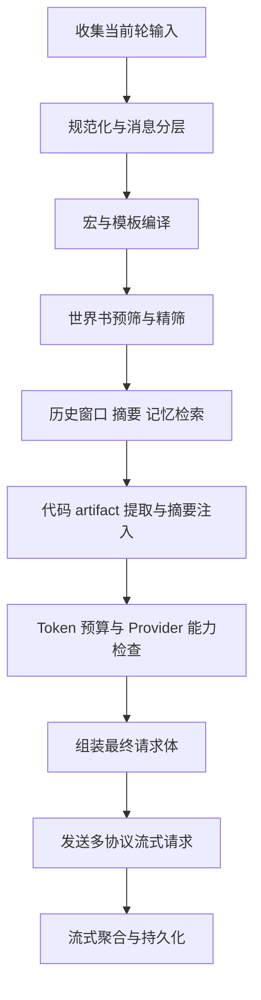

# Night Voyage 性能架构与技术栈建议

## 目标

本文用于沉淀 Night Voyage 在以下高负载场景下的后端性能架构思路：

- 超大型世界书
- 超大型角色卡
- 超长历史对话
- 对话中携带前端代码
- 预填充
- 正则规则
- 宏与模板
- 后续可演化的 Agent 模式

本文与 `plans/backend-ai-handoff.md` 配合使用。

## 任务分类

- 任务分类：后端规划
- 技术基线：`Tauri 2 + Rust + SolidJS host + SQLite`
- 当前结论：不通过引入更重的 LLM 框架来解决性能问题，而是通过 检索、编译、缓存、并发控制、冷热分层 来解决。

## 核心判断

Night Voyage 后续的性能重点，已经不是单纯的聊天请求发送，而是一个由多种重对象叠加出来的提示编译问题。

这些重对象包括：

1. 大世界书
2. 大角色卡
3. 长历史消息
4. 对话内代码块
5. 预填充片段
6. 正则规则
7. 宏模板
8. Agent 内部草稿与调度

因此主链路必须从 直接拼请求体 升级为：

- 检索驱动
- 编译驱动
- 缓存驱动
- 预算驱动
- 可观测驱动

## 总体架构原则

### 1. 永不假死

- UI 线程不参与任何重计算
- 后端所有耗时操作都异步或后台并行执行
- 发送后先给前端可见 loading，再在后台完成检索与编译

### 2. 热路径最短

每次发送都只走当前轮真正需要的数据，不允许默认全量扫描。

### 3. 冷热分层

- 热数据：最近轮次、当前摘要、命中的世界书、当前角色卡编译结果
- 冷数据：远古长历史、旧代码块、未命中的世界书条目、旧 agent 草稿

### 4. 零回退

- 不做静默降级
- 不做默认成功
- 不支持的 provider 能力必须显式报错
- 预填充、宏、正则、结构化输出必须走能力矩阵判断

## 性能高风险对象与处理策略

## 1. 超大型世界书

### 风险

- 发送时全表扫描
- 复杂正则逐条执行
- 大量条目重复参与匹配

### 策略

- 第一阶段用关键词预筛，不直接跑全量正则
- 世界书条目保存后就完成规则编译与合法性检查
- 命中逻辑拆成两层：
  - 关键词预筛
  - 精确匹配
- 只把命中的条目注入 prompt
- 命中结果按轮次缓存

### 推荐技术栈

- `aho-corasick`：关键词预筛
- `regex`：安全正则执行
- `regex-automata`：后续用于大规则集优化
- `moka`：命中缓存
- `SQLite FTS5` 或后续 `Tantivy`：大型全文检索增强

## 2. 超大型角色卡

### 风险

- 角色卡原文过长，发送时重复拼装
- 多开局、标签、默认绑定、记忆片段混在一起，导致 token 膨胀

### 策略

- 角色卡入库后拆成结构化字段与可编译片段
- 发送时使用 已编译角色片段，而不是原始全文重新拼接
- 为角色卡预计算 token 预算
- 将开局、多段设定、扩展信息做冷热分层

### 推荐技术栈

- `minijinja`：角色模板和宏编译
- `moka`：角色卡编译结果缓存
- 自定义 `TokenCounter`：角色片段预算

## 3. 超长历史对话

### 风险

- 每次发送都全量扫描消息表
- 长会话随着消息增长持续变慢
- 重新生成时重复读取无关消息

### 策略

- 使用 轮次表、聚合消息表、摘要表 三层结构
- 历史组装只读取：
  - 最近窗口
  - 会话摘要
  - 命中的历史记忆
- 不再默认回放全量原始消息
- 旧消息转为冷数据，按需检索

### 推荐技术栈

- `SQLite + sqlx`
- 会话摘要持久化
- 历史窗口分页
- 后续独立 `VectorStore` 抽象

## 4. 对话内前端代码

### 风险

- HTML CSS TSX JS 直接作为普通文本反复塞进上下文
- 同一段代码被反复解析与发送
- 大代码块拖慢匹配、裁剪与 token 统计

### 策略

- 把代码块提升为 artifact，而不是普通消息文本
- 对 artifact 进行指纹化、结构提取、摘要化
- prompt 中只注入必要摘要、结构信息或关键片段
- 原始代码单独持久化与缓存

### 推荐技术栈

- `blake3`：代码块指纹与去重
- `tree-sitter`：代码结构提取
- `moka`：artifact 解析缓存

## 5. 预填充

### 风险

- 不同 provider 对 prefill 支持差异大
- 若直接在热路径拼字段，会导致协议分歧和错误隐蔽

### 策略

- 建立 provider 能力矩阵
- 预填充在提示编译阶段判断是否合法
- 不支持的 provider 显式报错
- 不允许静默忽略 prefill

### 推荐技术栈

- 自定义 `ProviderCapabilityMatrix`
- 手写 provider adapters
- `serde` 与 `serde_json` 仅负责最终请求体构建

## 6. 正则

### 风险

- 大量规则在发送热路径即时编译
- 复杂语法带来不稳定性能

### 策略

- 保存时预编译与校验
- 发送时只执行已编译规则
- 默认使用 Rust regex 体系，避免高风险回溯特性
- 大规则集场景考虑 `RegexSet` 或 automata 路线

### 推荐技术栈

- `regex`
- `regex-automata`

## 7. 宏与模板

### 风险

- 发送前做大量字符串替换
- 模板错误在运行时才暴露

### 策略

- 宏系统独立为模板编译器
- 模板在保存时完成校验
- 发送时只执行安全渲染
- 宏渲染后的结果参与 token 预算与缓存

### 推荐技术栈

- `minijinja`
- `moka`

## 总体推荐技术栈

## 基础运行时

- `tokio`
- `reqwest`
- `sqlx`
- `serde`
- `serde_json`

## CPU 重任务层

- `rayon`
- 或 `spawn_blocking` 作为过渡方案

## 匹配与检索层

- `aho-corasick`
- `regex`
- `regex-automata`
- `SQLite FTS5`
- 后续可评估 `tantivy`

## 缓存与观测层

- `moka`
- `tracing`
- `tracing-subscriber`
- 后续可补 `metrics`

## 代码与内容处理

- `blake3`
- `tree-sitter`
- `minijinja`

## 未来扩展层

- 自定义 `VectorStore` 抽象
- 自定义 `EmbeddingGateway` 抽象
- Rig 仅保留为 embeddings RAG tool use 候选层
- `langchain-rust` 不进入主链路

## 不推荐作为性能主线的选择

### 1. 直接把聊天主链路迁入 Rig

原因：

- 当前主难题不是 Agent 编排，而是重对象编译、裁剪、协议控制
- 会降低多协议流式细节的可控性

### 2. 直接把聊天主链路迁入 `langchain-rust`

原因：

- 抽象偏重
- 对多协议流式与桌面端高可控热路径不够直接

### 3. 靠普通 SQL LIKE 扫描大型世界书

原因：

- 当条目和文本长度扩大后会明显退化

## 发送流水线建议

## 并发模型建议

### Tokio 负责 I O

- 数据库访问
- HTTP 请求
- 流式读取
- provider 调度
- agent 编排主流程

### Rayon 或阻塞池负责 CPU 热任务

- token 统计
- 世界书索引构建
- 正则编译
- 宏模板编译
- 代码结构解析
- 大文本摘要预处理

### 有界并发

- 导演 agent 与 NPC 子 agent 不能无限并发
- 使用 `Semaphore` 做并发上限
- 使用 `JoinSet` 或 `FuturesUnordered` 做聚合等待

## 数据层建议

### 主库继续使用 SQLite

适合承载：

- 会话
- 消息
- 轮次
- 世界书
- 角色卡
- 档案绑定
- 摘要
- 缓存元数据

### 必须补强的点

- 更多围绕热路径的索引
- 轮次聚合结构
- 摘要表
- 代码 artifact 表
- 世界书规则编译缓存表 可选

### 可选增强

- `FTS5` 用于全文检索
- 向量检索保持独立抽象，不在当前阶段强绑定实现

## Prompt Compiler 建议

后端需要明确新增一层 Prompt Compiler，而不是继续让聊天命令直接拼请求 JSON。

Prompt Compiler 负责：

1. 角色卡编译
2. 世界书触发匹配
3. 宏展开
4. 预填充合并
5. 历史窗口裁剪
6. artifact 注入
7. token 预算控制
8. provider 能力矩阵校验

输出应是一个稳定的中间结构，而不是直接字符串。

## 观测与画像

必须把性能问题做成可观测问题。

建议追踪以下指标：

- 世界书匹配耗时
- 角色卡编译耗时
- 历史裁剪耗时
- token 统计耗时
- provider 首 token 延迟
- agent 子调用耗时
- 总体 prompt 编译耗时
- 单轮总耗时

### 推荐技术栈

- `tracing`
- `tracing-subscriber`
- 后续可补充 `metrics`

## 风险上报

### 风险 1

- 风险点：若继续在发送时全量扫描世界书、角色卡、历史消息并即时拼接，会形成严重性能隐患。
- 影响范围：首 token 延迟、内存峰值、Android 稳定性、Agent 模式成本、数据库热点退化。
- 建议的修正方向：改为 检索、编译、缓存、预算、聚合 五段式流水线。

### 风险 2

- 风险点：若过早把向量检索绑定为 SQLite 扩展主路线，Windows 与 Android 的打包和兼容性可能成为高风险区。
- 影响范围：跨平台部署、升级稳定性、运行时兼容。
- 建议的修正方向：先抽象 `VectorStore`，晚一点再决定底层实现。

### 风险 3

- 风险点：若正则、宏、预填充都在发送热路径临时编译，随着世界书与角色卡膨胀会出现明显抖动。
- 影响范围：发送延迟、CPU 占用、长会话流畅性。
- 建议的修正方向：保存时完成编译和校验，发送时只执行已编译结果。

## 推荐落地顺序

1. 修复数据库就绪态问题
2. 把消息链路改造成轮次聚合和冷热分层
3. 引入 Prompt Compiler 中间层
4. 引入世界书两阶段匹配与缓存
5. 引入 token 预算系统
6. 引入代码 artifact 化
7. 引入 tracing 与性能画像
8. 最后再评估向量检索与 Agent 深化

## 最终结论

Night Voyage 的性能主线应该是：

- `tokio + reqwest + sqlx + SQLite`
- `rayon` 承接 CPU 热任务
- `aho-corasick + regex + FTS5 或 Tantivy` 承接大文本检索
- `minijinja` 承接模板与宏
- `moka` 承接缓存
- `tracing` 承接性能观测
- `blake3 + tree-sitter` 承接代码 artifact 化
- `VectorStore` 与 `EmbeddingGateway` 独立抽象，延后底层选型

也就是说，Night Voyage 不应把性能寄托在 更重的聊天框架 上，而应把性能建立在 编译、检索、缓存、预算、并发控制 这五个基础能力上。