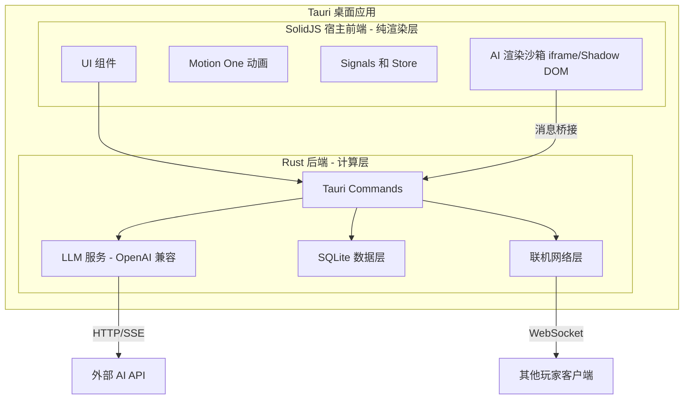
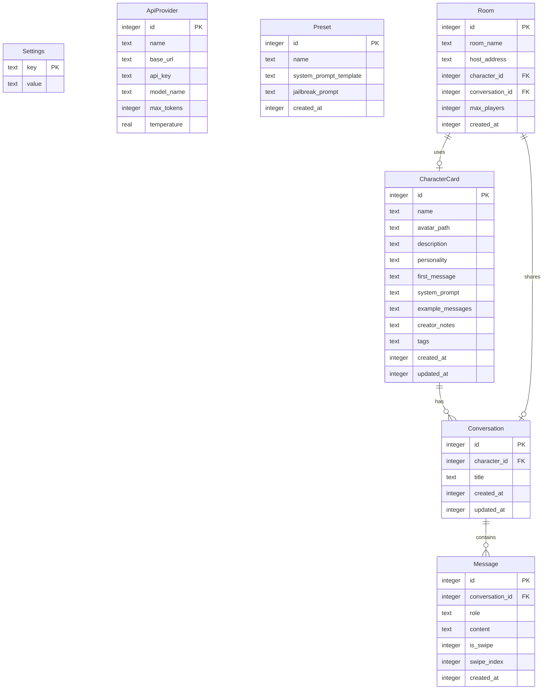
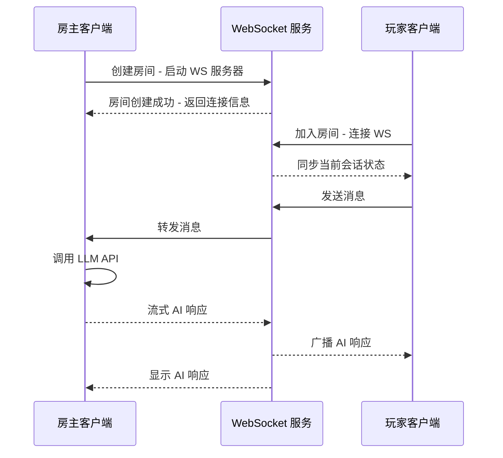

# 夜航船（Night Voyage）V1 开发计划

## 项目概述

打造一个高性能的 AI 跑团平台，支持大型会话、角色卡、对话预设的流畅加载与交互。

## 当前仓库状态

- 当前仓库前端已经是 `SolidJS + Motion + Vite + Tauri` 的最小可编译占位壳，不存在需要继续执行的旧 VDOM 前端迁移。
- 完整前端运行时后续由 Gemini 依据 `plans/gemini-frontend-rewrite-handoff.md` 重写；非 Gemini 只维护计划、治理和交接文档。

## 核心设计原则

### 铁律：永不假死

UI 线程在任何情况下都不能被阻塞。所有可能耗时的操作必须异步执行，配合加载状态反馈。

```
用户操作 → 立即响应（loading 状态/骨架屏/动画） → 后台异步处理 → 完成后更新 UI
```

具体约束：
- Rust 端：所有 Tauri Command 使用 `async`，耗时操作 spawn 到 tokio 任务，通过 Event 回传结果
- 前端：所有 `invoke` 调用使用 `async/await`，调用期间显示加载状态
- 数据库：所有 DB 操作异步执行，绝不在主线程同步查询
- LLM 调用：流式响应 + Event 推送，前端逐 token 渲染
- 联机操作：网络请求全部异步，连接/断开有明确状态提示

### 执行顺序：前端先行

新功能默认先完成前端交互设计，再推进后端 AI 对接实现。

- 先明确 SolidJS 宿主中的页面结构、组件状态、加载态、错误态、动画和 PC / 安卓布局，并把 Gemini 需要的前端重写要求整理进 `plans/gemini-frontend-rewrite-handoff.md`。
- 再整理后端 AI 对接契约，统一写入 `plans/backend-ai-handoff.md`。
- 后端实现只根据对接文档消费契约，不反向主导前端交互设计。
- 只要前端交互或接口契约变化，同步更新对应的交接文档。

### 性能优化策略（V1 内建）

**前端渲染层**
- 虚拟列表：消息列表优先采用适配 `SolidJS` 的虚拟化方案，只渲染可视区域 DOM；必要时优先选择 `@tanstack/virtual-core` 这类与宿主解耦的实现
- 细粒度渲染：依托 `SolidJS` signal/store 只更新受影响的消息片段，新消息不触发全列表重渲染
- 流式渲染隔离：流式生成中的消息用独立 signal/resource 管理，不影响其他消息
- Motion One 性能：动画仅使用 `transform`/`opacity`（GPU 合成友好），避免 layout 触发
- Markdown 渲染缓存：已解析的消息内容缓存结果，不重复解析
- AI 动态渲染隔离：剧情驱动生成的前端代码只运行在 `iframe` 或 `Shadow DOM` 沙箱中，宿主 `SolidJS` 渲染树不直接承载这类动态代码

**Rust 后端层**
- tokio 异步运行时：LLM 调用、DB 操作、WebSocket 全部异步
- SQLite WAL 模式 + 连接池：提升并发读写性能
- 消息分页加载：打开会话只加载最近 N 条，滚动时按需加载更多
- LLM 上下文在 Rust 端构建：避免大量数据在 IPC 间来回传输
- 流式事件节流：LLM token 推送每 50ms 合并一次，降低前端渲染压力

**IPC 通信层**
- 最小化传输数据：列表只传 ID + 摘要，详情按需获取
- 批量接口：需要多条数据时用批量查询，减少 IPC 调用次数

**SQLite 优化**
- 关键字段建索引：`conversation_id`、`character_id`、`created_at`
- 预编译语句缓存：避免重复编译 SQL

## 技术选型

| 层级 | 技术 | 说明 |
|------|------|------|
| 桌面框架 | Tauri 2.x | 窗口管理、系统集成、打包分发 |
| 后端 | Rust | 所有网络、数据库、LLM 接入、流式解析、计算逻辑、数据处理、API 调用 |
| 前端宿主 | SolidJS + TypeScript | 宿主 UI 渲染，纯展示层，承接高速流式输出 |
| 动画 | Motion One | 交互动画，优先走 GPU 合成线程 |
| AI 渲染层 | iframe / Shadow DOM + HTML + Tailwind | 隔离 AI 动态生成 UI，避免污染宿主性能与样式 |
| 存储 | SQLite | 本地数据持久化 |
| AI 接入 | OpenAI 兼容 API | 支持所有 OpenAI 兼容的模型服务 |

## 系统架构



## 数据模型



## 前后端通信方式

前端通过 Tauri 的 `invoke` 机制调用 Rust 后端命令，无需 HTTP 请求：

```
前端: invoke('send_message', { conversationId, providerId, content })
      ↓ Tauri IPC
后端: #[tauri::command] fn send_message(...)
      ↓ 处理逻辑
      ↓ 调用 LLM API（SSE 流式）
      ↓ 通过 Tauri Event 推送流式响应（`llm-stream-chunk.done = true` 表示完成）
前端: listen('llm-stream-chunk', callback)
```

## 多人联机架构 - 房主模式



房主机器同时作为：
- 本地应用（自己使用）
- WebSocket 服务器（其他玩家连接）
- AI API 调用方（使用房主的 API Key）

## V1 功能模块与开发阶段

### 阶段 1：项目基础搭建
- 初始化 Tauri 2.x + SolidJS + TypeScript 项目
- 保留当前 SolidJS 占位壳作为可编译基座
- 配置构建工具链（Vite + Rust toolchain）
- 搭建 SQLite 数据库层（使用 rusqlite 或 sqlx）
- 建立前后端通信基础架构（Tauri Commands + Events）
- 产出 Gemini 前端重写交接文档（`plans/gemini-frontend-rewrite-handoff.md`）
- 设计并实现基础 UI 框架规范（SolidJS 宿主布局、路由、主题）
- 建立后端 AI 对接文档模板（`plans/backend-ai-handoff.md`）

### 阶段 2：核心聊天功能
- 实现 API Provider 管理（添加/编辑/删除 API 配置）
- 实现 OpenAI 兼容 API 调用（支持 SSE 流式响应）
- 实现消息发送与接收（流式渲染）
- 实现消息 Swipe 功能（重新生成/切换回复）
- 实现会话管理（创建/切换/删除/重命名）
- 由 Gemini 按交接文档重写聊天界面 UI（消息列表、输入框、Motion One 动画）
- 建立 AI 动态 UI 沙箱桥接（`iframe` 或 `Shadow DOM`）
- 输出首版聊天链路后端 AI 对接说明（命令、事件、载荷、错误状态、性能约束）

### 阶段 3：角色卡系统
- 实现角色卡 CRUD（创建/读取/更新/删除）
- 实现角色卡头像管理
- 实现角色卡与会话的关联
- 实现 system prompt 模板渲染（角色卡字段注入）
- 实现角色卡列表与详情 UI

### 阶段 4：对话预设系统
- 实现预设 CRUD
- 实现预设模板变量系统
- 实现预设与会话的绑定
- 实现预设管理 UI

### 阶段 5：多人联机
- 实现房主端 WebSocket 服务器（嵌入 Tauri 应用内）
- 实现玩家端 WebSocket 客户端
- 实现房间创建/加入/离开
- 实现会话状态同步
- 实现多人消息广播
- 实现联机 UI（房间列表、玩家列表、连接状态）

### 阶段 6：打磨与打包
- UI/UX 优化与 Motion One 动画完善
- 错误处理与用户提示
- 应用打包与分发配置（Windows 优先）
- 基础设置页面（主题、语言等）

## 后续版本规划（非 V1）
- 向量化检索与会话总结
- 大型会话性能优化
- 角色卡导入/导出
- 插件系统
- 更多平台支持（macOS / Linux）

## 项目目录结构预览

```
night-voyage/
├── plans/
│   ├── v1-plan.md
│   ├── gemini-frontend-rewrite-handoff.md # Gemini 前端重写交接入口
│   └── backend-ai-handoff.md # 前端先行后的后端 AI 对接文档
├── src-tauri/              # Rust 后端
│   ├── src/
│   │   ├── main.rs         # Tauri 入口
│   │   ├── commands/       # Tauri Commands
│   │   │   ├── mod.rs
│   │   │   ├── chat.rs     # 聊天相关命令
│   │   │   ├── character.rs # 角色卡命令
│   │   │   ├── conversation.rs # 会话命令
│   │   │   ├── preset.rs   # 预设命令
│   │   │   ├── settings.rs # 设置命令
│   │   │   └── room.rs     # 联机房间命令
│   │   ├── db/             # 数据库层
│   │   │   ├── mod.rs
│   │   │   ├── schema.rs   # 表结构定义
│   │   │   └── migrations/ # 数据库迁移
│   │   ├── llm/            # LLM 服务
│   │   │   ├── mod.rs
│   │   │   └── openai.rs   # OpenAI 兼容实现
│   │   ├── network/        # 联机网络层
│   │   │   ├── mod.rs
│   │   │   ├── server.rs   # WebSocket 服务器
│   │   │   └── client.rs   # WebSocket 客户端
│   │   └── models/         # 数据模型
│   │       └── mod.rs
│   ├── Cargo.toml
│   └── tauri.conf.json
├── src/                    # SolidJS 宿主占位壳，后续由 Gemini 重写
│   ├── App.tsx             # 临时占位页
│   ├── index.tsx           # 宿主挂载入口
│   └── index.css           # 入口样式
├── package.json
├── tsconfig.json
├── vite.config.ts
└── index.html
```
